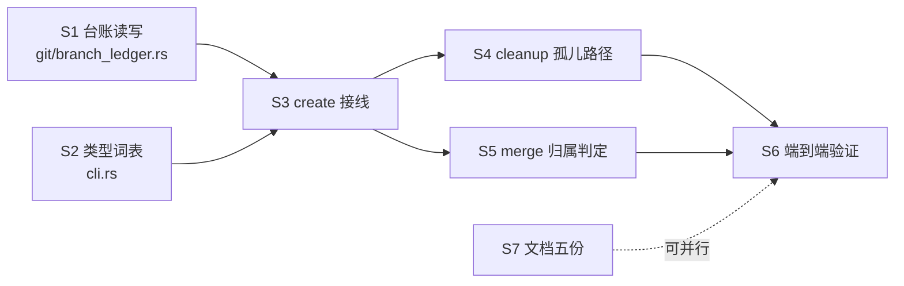

## 要动的地方

六处，依赖关系是一条链，只有文档那步能跟别的并行。

共用文件只有 `src/commands/create.rs`（S2 和 S3 都碰），由同一个人按 S2→S3 的顺序改，不并行。

## S1 台账的读写

**用到**：`git2 0.19` 的 `Repository::config()`；设计里「分支台账」一节。

**改**：新增 `src/git/branch_ledger.rs`，在 `src/git/mod.rs` 里挂上。

**行为**：三个函数。`record(repo_path, branch, task_ref)` 写
`branch.<branch>.udftask`；`lookup(repo_path, task_ref) -> Vec<String>` 枚举所有
`branch.*.udftask`，返回值等于 `task_ref` 的分支名；`task_of(repo_path, branch) -> Option<String>`
读单条。

**注意**：git 会把键名归一成小写，枚举时按小写 `udftask` 匹配。分支名（配置的 subsection）
大小写敏感，原样取出。

**测试先写**：`branch_ledger` 的单元测试，用临时仓库。四条：写完能读回；分支名带斜杠和点
（`release/v1.2`）能正确解析出来；`git branch -D` 之后台账条目消失；同一分支重复写是覆盖
不是累加。

**证明**：`cargo test branch_ledger` 全绿。

## S2 类型词表

**用到**：设计里的六个类型。

**改**：`src/cli.rs`。

**行为**：新增 `#[derive(ValueEnum)] pub enum ChangeType { Feature, Fix, Hotfix, Refactor, Docs, Chore }`，
`TaskAction::Create` 加 `#[arg(long = "type", value_enum)] change_type: Option<ChangeType>`。
clap 自动做取值校验，非法值在解析阶段就被拒并列出可选值，不需要自己写校验。

**测试**：`udf task create --type nonsense` 退出码非零且错误里列出六个值。

**证明**：命令实测输出。

## S3 create 接线

**用到**：S1 和 S2。

**改**：`src/commands/create.rs`、`src/main.rs`（传参）。

**行为**：默认分支名从 `task/{workspace}/{task_id}` 改成 `{type}/{task_id}`，`type` 取
`--type`，不给按 `feature`。`--branch` 仍然整个覆盖；两个都给时忽略 `--type` 并打一行提示。
`git::worktree::add` 成功之后，对该 `plan.source_repo` 调 `branch_ledger::record`，写失败只
警告不回滚——分支是主产物，台账是索引。

**测试先写**：`tests/create_sources.rs` 加三条。默认名是 `feature/<id>` 且不含 workspace；
`--type fix` 得到 `fix/<id>`；两个不同 workspace 同名 task-id 得到相同分支名。

**证明**：`cargo test --test create_sources` 全绿，加一次真实 `task create` 后 `git branch`
的输出。

## S4 cleanup 的孤儿路径

**用到**：S1、S3。

**改**：`src/commands/cleanup.rs::expected_branch_names`。

**行为**：先查台账，把命中的分支名加进候选；再按老规则拼 `task-<id>` 和 `task/<ws>/<id>`
兜底。两组合并去重。函数签名从「只吃 config 和 task_ref」变成还要吃候选仓库路径——它已经
有 `candidate_plugin_roots`，在同一个循环里查即可。

**测试先写**：`tests/merge_yes.rs` 加一条：分支名故意起成不含 task-id 的
`release/unrelated`，写好台账，删掉 Host，`cleanup` 能找到并删掉它。

**证明**：`cargo test --test merge_yes` 全绿。

## S5 merge 的归属判定

**用到**：S1。

**改**：`src/commands/merge.rs` 的 `branch_matches`。

**行为**：原有三条判定一条不删，再加第四条——台账里这个分支的 `udftask` 等于当前任务引用。
四条任一成立即放行。

**测试先写**：`tests/merge_yes.rs` 加一条：分支名不含 task-id、元数据被改成跟分支不一致时，
台账仍能让 merge 放行；台账也对不上时仍然拒绝。

**证明**：`cargo test --test merge_yes` 全绿。

## S6 端到端验证

**用到**：S3、S4、S5 都合上之后。

**改**：不改代码。

**行为**：在临时 git 仓库里跑完整链路，不碰用户的真实插件仓库。三组：默认类型、
`--type fix`、完全自定义 `--branch` 加 Host 删除后的孤儿清理。另外构造两个历史形态的任务
（`task/<ws>/<id>` 和 `task-<id>`）验证 merge 和 cleanup 没坏。

**证明**：每组的命令与输出，以及 `git branch` 的前后对比。

## S7 文档

**用到**：S2 定下的参数名。

**改**：`AGENTS.md`、`CLAUDE.md`、`README.md`、`skill/SKILL.md`、`skills/unrealdevflow/SKILL.md`。

**行为**：分支名示例改成 `<type>/<task-id>` 形态，`task create` 的示例加上 `--type`，
说明默认值和六个可选值。命令速查表补一行。

**证明**：脚本抽出五份文档里所有 `udf` 开头的整行示例，逐条对着 `--help` 核参数，失败 0 条
——沿用上一个任务用过的那个核对脚本。

## 风险

**台账写进用户的插件仓库配置。** 每个任务分支一行，`git branch -D` 时 git 自己带走。风险是
如果哪天有人用 `git update-ref -d` 之类的底层命令删分支，配置段会留下。影响只是多一条查不到
分支的索引，`lookup` 返回的分支名在仓库里不存在时直接跳过即可。S1 的 `lookup` 要带这个过滤。

**孤儿清理的判定范围变宽了。** 以前只删名字能拼出来的分支，现在还删台账指名的。台账是我们
自己写的，指向明确，不会误伤别人的分支。但 `cleanup` 删分支前的确认提示要把分支名列出来，
让人能看见要删什么——这条现在就有，保持。

**`--type` 不是必填，可能满屏 feature/。** 用户已经权衡过并选了可选。不在这次范围内。
