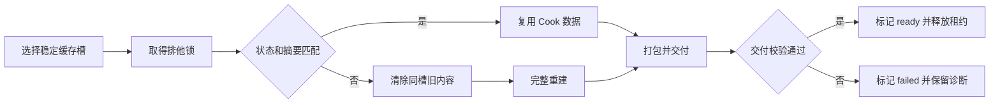

# 项目打包缓存清理和复用设计

## 目标

UDF 要能解释每一份 package 数据的归属，保护正在使用的数据和最终包，并把长期缓存限制在明确额度内。

## 背景

本机可确认由 UDF package 管理的数据占 1,022,227,856,858 bytes。现有
`package clean --dry-run` 只报告 99,565,101 bytes。8 份 iterate 缓存中只有 1 份对应当前
workspace profile，7 份旧缓存占 580,501,374,497 bytes。

目录增长来自三处：profile revision 参与目录名、iterate 缓存没有清理入口、旧执行记录没有迁移。
任务插件没有进入复用摘要，交付完成后的备份也不会自行删除。

## 不做什么

- 不让 UDF 自动删除 `C:\Package`、用户指定输出或没有 UDF manifest 的文件。
- 不把 UE 项目共用的 `Intermediate`、`Saved\Cooked`、`Saved\StagedBuilds` 直接认领为 UDF 数据。
- 不把 AES Work Item ID 强塞进 package。UDF task 与 AES Work Item 是两套身份；没有显式桥接就显示未绑定。
- 不用数据库保存缓存状态。目录内状态文件和 execution JSON 已经足够。

## 方案对比

| 方案 | 做法 | 代价 | 结论 |
| --- | --- | --- | --- |
| A. 统一盘点、稳定缓存槽、活动租约和清理规则 | 修正目录身份，补全状态，clean 同时报告 staging、cache、日志和备份 | 需要改 5 个生产文件、4 组测试和 3 处文档 | 推荐。能同时解决空间、误复用和旧记录 |
| B. 只增加 `package cache clean` | 保留当前目录名，按时间或容量删 hash 目录 | profile 每改一次仍会复制项目，任务插件仍可能误复用 | 不选。只能缓解磁盘占用 |
| C. 保持现状，写一条手工脚本 | 人定期删两个目录 | cleaner 继续漏报，脚本不能证明最终包和活动执行边界 | 不选。风险留给每次人工操作 |

## 推荐方案

### 一份统一盘点

新增 `PackageInventoryItem`，所有清理判断先产出这份只读清单。每项包含：

| 字段 | 含义 |
| --- | --- |
| `category` | execution stage、cook cache、log、delivery backup、profile、record、final output 或 unknown |
| `path`、`bytes`、`lastModified` | 目录、普通文件字节数和时间 |
| `ownerKind`、`ownerId` | workspace、UDF task、execution 或未识别 |
| `executionIds` | 能证明引用这一路径的 execution |
| `state` | building、ready、failed、stale、orphan、delivering、delivered |
| `active` | 是否有有效租约和匹配进程 |
| `protection` | 为什么必须保留 |
| `reclaimReason` | 为什么可以清理 |
| `confidence` | verified、legacy-matched 或 unknown |

盘点扫描这些固定来源：

1. `~\.unrealdevflow\executions\package` 的 execution JSON。
2. `%TEMP%\UDF` 和旧根 `%TEMP%\UnrealDevFlow\package-stage`。
3. `~\.unrealdevflow\package\cook-cache` 和 `profiles`。
4. execution 记录中的日志、事务备份、manifest 和输出路径。
5. workspace 与 task profile 指向的当前缓存槽。

Junction 只统计链接本身，不遍历目标。受管路径必须落在算出的固定根下；目录名中碰巧出现
`UnrealDevFlow` 或 `.udf-logs` 不再构成删除授权。

### 稳定的缓存槽

目录名只使用会决定缓存隔离边界的字段：

```text
cache schema
+ task_uid
+ canonical project
+ canonical engine
+ target platform
+ configuration
+ container
```

`profile.revision`、包名、输出路径和修改理由退出目录名。这些字段继续写进 execution 和缓存状态，供审计使用。

项目设置摘要、源项目摘要、任务插件 overlay 摘要、禁用插件列表写进状态文件。它们变化时，UDF 在同一个缓存槽内
清除旧内容并完整重建，不新建另一个 100 GB 级目录。源摘要不能进入目录名，否则每次改代码仍会制造新目录。

workspace 与 task 继续分槽。不同 task 的主插件来源不同，不能跨 task 共用 Cook 状态。

### 可验证的缓存状态和活动租约

`.udf-cook-cache.json` 升到 schema 2，写入：

- `cacheId`、`taskUid`、project、engine、platform、configuration、container。
- `profileRevision`、`projectSettingsDigest`、`sourceFingerprint`、`overlayFingerprint`。
- `state`、`createdAt`、`lastUsedAt`、`lastSuccessAt`、`executionId`、`producerVersion`。

执行期间另持有一个排他锁，并写租约文件：PID、进程开始时间、主机、execution ID、获得时间和最近更新时间。
clean 必须同时检查锁、PID 与进程开始时间。JSON 中残留的 `running` 不能证明进程仍活着。

状态流转：



任务插件 overlay 必须先算摘要，再判断是否复用。overlay 变化时走同槽重建，不能继续使用旧插件副本。

### 清理规则

默认配置：

| 规则 | 默认值 | 行为 |
| --- | ---: | --- |
| 每个 binding 最多保留的 ready 缓存 | 2 | 保留最近使用的配置组合 |
| 未使用缓存保留时间 | 7 天 | 超时进入 stale 候选 |
| failed 或中断 staging 保留时间 | 24 小时 | 留出看日志和恢复时间 |
| 普通 execution 日志保留时间 | 14 天 | 超时进入候选，记录 JSON 继续保留 |
| 全局缓存上限 | 磁盘容量的 30%，最高 250 GiB | 超过时按最久未使用顺序列候选 |
| 磁盘剩余保护线 | 磁盘容量的 10%，最低 50 GiB | 预计执行后低于保护线就阻止启动 |

清理顺序固定为：孤儿、失败或中断、旧 schema、被当前 profile 取代的槽、超过 7 天的非当前槽、超过容量上限的
非当前槽。当前槽和有效租约永远不自动删除。规则算完仍超过上限时，命令报告阻塞和需要人选择的缓存。

跨 task 或跨 workspace 的删除不由 package 执行自动触发。打包前可以自动删除本次 execution 的成功 staging、
同 binding 已被取代的无租约缓存和已经完成校验的事务备份。全局清理必须显式执行并确认。

### 命令行为

保留现有入口并收紧范围删除：

```powershell
udf package clean --dry-run
udf package clean --dry-run --workspace neon-dev
udf package clean --dry-run --task neon-dev/my-task
udf package clean <execution-id>
udf package clean --cache <cache-id>
udf package clean --stale --workspace neon-dev --yes
udf package clean --legacy --dry-run
udf package clean --legacy --yes
```

无参数继续只盘点。`--workspace`、`--task`、`--stale`、`--legacy` 只要会删除多项，就必须带 `--yes`；
省略时输出同一份 dry-run 清单。精确 execution ID 或 cache ID 仍可删除，但必须通过固定根、状态和租约检查。

JSON 输出同时给出：总字节、可清理字节、受保护字节、未识别字节，以及每项的判断理由。
最终包只出现在 `protected` 列表，任何 clean 选项都不能把它变成删除目标。

### 交付备份和 Archive

`publish_directory()` 复制完成后要核对目标文件摘要。摘要全部匹配才把事务标成 `delivered`。
状态写入成功后删除 `delivery-backup`。任一步失败时保留 `delivering` 和备份，`recover` 继续按现有事务日志回退。

持久缓存中的 `Archive` 已经会在下一次复用前删除，说明它不属于 Cook 复用数据。交付成功后立即删除 `Archive`。
`Saved\StagedBuilds` 是否可删由真实 UE iterate 回归决定；验证通过前保持现状。

### 空间预检

预检统计所有 UDF package 受管根，不再只看本次 staging。下一次预计占用取三者最大值：

1. 同项目最近一次成功缓存的实际字节数。
2. 本次源输入字节数的 2.5 倍。
3. 1 GiB 的最低估算。

预检先扣除可安全自动回收的本 binding 数据，再判断剩余空间。空间不足时返回候选目录、预计可回收字节和下一条
dry-run 命令，不修改别的 task 或 workspace。

### 归属关系

| 对象 | 必须记录的身份 |
| --- | --- |
| workspace profile | `workspace/<name>` |
| task profile | UDF `workspace/task-id` |
| project 与 plugin execution | `taskRef` 或 workspace |
| cook cache | `taskUid`、cache ID、最近 execution |
| AES Work Item | 默认 `unbound`。只有调用方显式传入并能验证时才记录 |

插件包要和项目包一样保存 `requested_task`。旧记录只在 execution ID、命令中的项目路径、cleanup target 三者相互吻合时
标成 `legacy-matched`。证据不足的目录只能隔离或由人确认。

## 本机一次性清理方案

方案落地前不直接删除 1 TB 级目录。新版 cleaner 先生成 JSON 清单并保存到任务记录旁，随后按以下顺序处理：

1. 保留两个 profile、全部 execution JSON、`C:\Package` 的 44.31 GB 最终包和当前缓存
   `c20e7e7f47adb0d3d0db3788778b708d`。
2. 把两个成功旧 staging 的 `Archive` 和 10.90 GB 的已交付旧备份列为 `manual-review`。
   它们记录的最终输出已经不存在。用户选择保留时，把它们移到 `C:\Package\Recovered-UDF\<execution-id>`，再清 staging。
3. 删除无活动进程的 failed、stale-running 和 orphan staging。当前可确认 4 份，约 105.11 GB。
4. 删除 7 份非当前 cook-cache，约 580.50 GB。三个无状态目录先按 orphan 报告；四个旧 revision 按 superseded 报告。
5. 清理 14 天以上日志、`%TEMP%\UnrealDevFlow\package-stage` 和空的 `~\.unrealdevflow\package-test`。
6. 再跑全局 dry-run。受管的非最终数据应只剩当前缓存、未到期日志和用户选择保留的恢复包。

两个成功 staging 与旧备份作出选择后，本机预计可释放约 685 GB 到 924 GB。范围差来自需要人工判断的旧包副本。

## 边界和失败处理

| 情况 | 行为 |
| --- | --- |
| 租约存在且进程匹配 | hard protect，任何 clean 选项都拒绝 |
| JSON 写着 running，但进程不存在 | 标成 stale-running，24 小时后成为候选 |
| 目录含 Junction | 删除链接本身，不进入目标；统计也不进入目标 |
| 旧记录缺 `targetKind` | 默认只报告；三方证据吻合后才允许 `--legacy --yes` |
| 交付状态是 delivering | 保护 backup，允许 recover |
| 交付状态是 delivered，但输出不存在 | manual-review，不自动删 backup |
| 最终输出含 manifest 外文件 | 保护整个输出，clean 不触碰 |
| 清理中途失败 | 已删除项逐条更新，未删除项保持原状态，命令返回 partial |

范围删除必须更新每一条受影响 execution。当前代码只更新 `records.first_mut()`，本任务要一并修正。

## 影响面

直接影响至少 15 个文件：

- 生产代码 8 个：`src/cli.rs`、`src/main.rs`、`src/config.rs`、`src/commands/package.rs`、
  `src/package_profile.rs`、`src/package_storage.rs`、`src/package_inventory.rs`、`src/package_cache.rs`。
- 测试 4 个：`tests/package_lifecycle.rs`、`tests/package_profile.rs`、
  `tests/package_commands.rs`、`tests/cli_taxonomy.rs`。
- 文档 3 个：`README.md`、`skills/unrealdevflow/SKILL.md`、`docs/releases/v0.5.0.md`。

复算命令：

```powershell
rg -l "package clean|cook_cache_root|CookCacheState|PackageMetadata|StorageReport" src tests README.md skills docs
```

现有测试中，`package_lifecycle.rs` 有 15 个测试，`package_commands.rs` 有 8 个，
`package.rs` 内部有 10 个，`package_storage.rs` 内部有 2 个。它们没有覆盖稳定缓存槽、活动租约、孤儿盘点、
范围确认、overlay 摘要、全局容量和逐记录状态更新。

## 怎么算做对

- 当前 profile 只对应一个稳定缓存槽。只改包名、输出路径、修改理由或 revision 后，缓存目录不变。
- 项目、引擎、平台、配置、容器或 task 变化时，目录隔离。
- 源项目、项目设置、禁用插件或 task overlay 变化时，同槽完整重建，旧内容不会进入包。
- 全局 dry-run 报告当前机器至少 1,022,227,856,858 bytes 的受管数据，并把最终包列为保护项。
- 有租约的目录无法删除。失效租约、旧记录和孤儿目录都有明确理由与确认要求。
- 连续修改 profile 并打包 10 次后，每个 binding 最多保留 2 个 ready 槽，磁盘不会按 revision 线性增长。
- 交付成功后不留下 `Archive` 和无用 backup；交付中断仍能 recover。

## 用户确认

用户在 2026-09-07 选择 B：采用推荐方案和默认保留规则。本机两个成功 staging 的 `Archive`
与 10.90 GB delivered 旧备份确认删除，不移到 `C:\Package\Recovered-UDF`。
