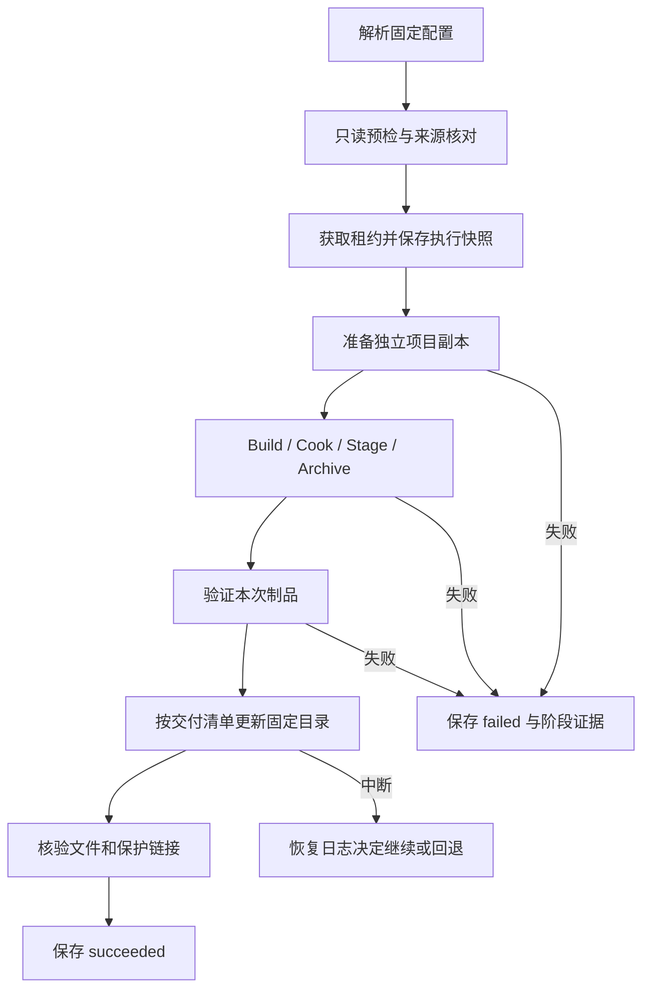

# 任务打包配置与安全交付设计

## 结论与状态

每个 task 首次需要打包时保存一份配置，之后按该配置运行。用户或 AI 可以更新配置，
更新要写原因和差异。每次执行固定当次配置、源码来源及产物身份，后续修改不追溯旧执行。

本设计为 proposed，允许评审，不表示已实现或已获实施授权。
用户已授权本轮在没有待讨论问题时由 Wayfinder 进入设计；新增技术细节没有冒充用户逐项确认。

## 背景与目标

Shipping 无法通过现有 CLI 选择。历史会话手工拼接参数后，三次失败共花费 8648 秒，
其中包含错误归因、共享来源不一致和旧产物误识别风险。用户明确要求支持禁用无法打包的插件，
保留外部数据链接，并固定 task 配置。C:/Package/Windows 是用户手动对照实验。

事实见 research/ 下六份调查及独立复核；原始日志索引见 reference/reference.md。
目标是使后续实现能以明确的来源、参数和交付规则打包，并准确报告失败。

## 非目标

- 不自动修复业务模块、材质或运行时面板。
- 不修改引擎，不忽略 Cook error 以强行产包。
- 本轮不实施、不运行 UE、不发布工具；不更改插件独立打包已有 NoMutex 约定。
- 首批实现验收面向 Windows、UE 5.5、Win64 Game。其他平台、Server、DLC、签名和商店发布需要另行适配。
- 外部数据不全量复制时，不承诺任意外部写入者无法在 Cook 期间修改数据。

## 方案对比

| 路线 | 做法 | 代价 | 判断 |
| --- | --- | --- | --- |
| 保持现状 | Agent 手拼 UAT | 无新增实现；配方和恢复靠会话记忆 | 不能满足用户要求 |
| 仅保存参数 | 在共享项目原地切插件和打包 | 改动少；会话间仍竞争描述文件和 Junction | 只覆盖 Shipping 缺口 |
| 固定配置与独立项目副本 | 冻结配方、复制可写输入、保护外部数据、验证后交付 | 需要准备检查、空间与交付恢复 | 采用，覆盖本次事故 |
| 每次完整复制全部项目与数据 | 所有输入都复制 | 数据复制成本随美术库增长 | 可留严格快照扩展，本轮不强制 |

采用副本模式不意味着所有项目天然可搬迁。绝对 Build.cs 路径、预编译插件及外部写入行为
必须通过准备检查。不能处理时阻塞并解释，不自动转为原地修改。

## 配置的归属与生命周期

| 项 | 约定 |
| --- | --- |
| task 当前配置 | Host 根的 .udf-package.toml，仅一份正本 |
| 实例绑定 | task_uid、created、规范化 Host 路径；不只看 workspace/task-id |
| 修订历史 | Config::config_dir() 下按实例保存不可变修订，不参与 current 默认值解析 |
| 执行记录 | 复用 executions/package，新增 profile_revision 和 source_snapshot 引用 |
| Host 删除 | 跟随删除当前配置；保留历史执行及修订，清理需单独明确操作 |
| 同名任务重建 | 新 created 对应新实例，不自动继承旧配置 |
| 无任务的 workspace | 配置命名空间绑定规范化 project 与 workspace，和 task 分开 |
| 导出及导入 | 导入后重新解析本机路径和任务绑定；敏感信息不写公开配置 |

初始化可以给出来自项目的建议值，但 check/plan 不创建配置。
配置修订先写不可变候选，再比较 current 预期摘要并原子替换；失败留下可识别的未生效候选，
不能把候选当成当前版本。手工编辑视为候选，需要 update/import 写原因后接纳。

配置更新不修改正在运行的执行。下次执行使用新修订；retry 默认使用原执行的快照，
若要换配方必须显式指定新修订并创建新的执行记录。

## 配置包含什么

| 组 | 字段与含义 |
| --- | --- |
| 身份 | schema_version、task 绑定、revision、修改者、原因、父修订 |
| 来源 | 完整项目路径、task 主插件来源、依赖解析结果、引擎路径与版本 |
| 目标 | platform、target_name、target_type、configuration |
| 编译 | Editor prerequisite=auto、Game build、clean 显式开关 |
| Cook | full 或 iterative、显式 maps 或冻结项目策略、Editor 内容策略 |
| 分发 | loose/pak/iostore、compression、prereqs、debug files |
| 插件 | disable_plugins；不默认关闭任何名称，不自动级联排除依赖者 |
| 数据 | source path、mount path、链接类型、保护范围、可用版本标识 |
| 输出 | 受管工作目录、stage、archive、固定 delivery、覆盖规则 |
| 扩展 | 分离 uat_args、ubt_args、cook_args，按版本检查冲突 |
| 质量 | Shader 回退默认警告；可显式提高为质量门槛，保留原 UAT 成败 |

目标配置固定，代码提交可以继续变化。每次执行记录实际提交与 dirty 内容摘要，
不把更新代码自动判断为配方过时。

初始化冻结的是打包设置，不冻结全部游戏逻辑配置。副本复制当前项目配置，
用保存的 Packaging 值覆盖打包决策项，并记录参与解析的配置来源和摘要。
如果默认地图等会改变 Cook 范围的值变化，提示配置过时，不暗中更新。

### 何时必须更新

| 变化 | 行为 |
| --- | --- |
| 普通源码提交、可识别 dirty 修改 | 新执行记录新源码快照，配方继续有效 |
| 项目/引擎路径丢失、任务实例不符 | blocked，不猜替代路径 |
| 引擎版本、Target、插件依赖或 Packaging 值变化 | needsUserInput 并展示差异；用户或 AI 可显式 update |
| 仅说明文字变化 | 不改变执行语义摘要 |
| 未知配置字段、不能解析的 INI 层次 | 拒绝生效，列出字段或文件，不默默忽略 |

needsUserInput 只表示需要补齐输入，不强制每次都找人批准。
AI 已有明确方向时可以更新，但必须记录理由；安全策略不能通过自由参数绕过。

## CLI 与兼容

以下是拟新增接口，当前版本尚不存在：

```powershell
udf package config init --task neon-dev/runtime-panel-full-reflection --project "<完整项目>" --configuration development --container loose --delivery "<固定目录>" --disable-plugin ModelContextProtocol --disable-plugin AllToolsets
udf package config show --task neon-dev/runtime-panel-full-reflection
udf package config update --task neon-dev/runtime-panel-full-reflection --configuration shipping --reason "验证 Shipping 发布配置" --expected-revision "<当前摘要>"
udf package plan project --task neon-dev/runtime-panel-full-reflection --format json
udf package check project --task neon-dev/runtime-panel-full-reflection --format json
udf package project --task neon-dev/runtime-panel-full-reflection --background
udf package status "<execution-id>"
```

config import 从文件或成功日志生成候选并明确采纳，不直接执行日志里的命令。
原始日志不成为 shell 输入。导出不得包含密钥或个人登录信息。

已有 project/check/plan/run 使用同一解析器；实际运行前重新核验来源与执行锁。
check/plan 都只读，不创建 execution ID，不覆盖 latest；human plan 展示来源、参数、配置差异和输出位置。

| 调用情况 | 行为 |
| --- | --- |
| 有保存配置 | 使用该修订，不接收暗中覆盖配方的临时配置参数 |
| 无配置的旧 --task | 保持打包 Host 的历史语义，显示 legacy 提醒与 init 建议 |
| 新 config init --task | 推荐完整 context.default_project，明确展示并保存；可显式选择 Host |
| 同时 workspace 与 task 不一致 | 拒绝，不静默优先其中一项 |
| 旧 status JSON | 保留已有字段，新字段可选；旧记录缺失信息标 unknown |
| package plugin/engine | 保留现有语义，本轮不附加项目插件排除策略 |

Shipping 通过 config init/update 暴露。不得把一次 package 调用的临时 Shipping 参数悄悄写入永久配方。
旧 legacy 路径仍需接入执行租约和终态记录等安全修复，但不能自动改变其项目来源。

## 项目准备与插件排除

1. 解析真实项目、TaskMeta 和全部主/依赖插件路径；拒绝重名歧义及损坏链接。
2. 获取准备目录租约，复制 .uproject、Source、Config、Build 及需要的插件文件到任务专用短路径工作目录。
3. 保持项目与 Target 名称；编译、Intermediate、Saved 写入副本。编译型与预编译插件按 receipt 分别检查。
4. 直接消费已解析任务 worktree，不通过 DEV 的可变 Plugins 链接取代码。
5. 在副本 .uproject 排除配置中的插件，核对强依赖、平台与 Target 条件；冲突时显示依赖路径。
6. 处理声明的 Content 和数据映射，记录实际目标。源码复制前后清单不一致则拒绝准备结果。
7. 将准备清单、配置和 SourceContext 固定为本次输入。

未知的 AdditionalPluginDirectories、绝对脚本路径或会写源数据的构建步骤必须报告。
工具不得为省复制成本把可写源码目录硬链接回原项目。预编译 DLL 不能只看文件存在，
需要引擎、平台、配置与 Build receipt 一致。

共享内容采用读取引用时，租约只约束工具自身。对接 Git/LFS revision 或外部数据版本清单，
记录检测范围；无版本的大数据目录不能声称完整可重现。发现变化时执行不可作为可信交付。
若项目要求严格不可变输入，应配置快照复制模式并先检查空间，不自动复制整个数据库。

## UAT 生成规则

| 设置 | UE 5.5 行为 |
| --- | --- |
| configuration=shipping | 生成 -clientconfig=Shipping，Target 验证通过后执行 |
| container=pak | -pak |
| container=iostore | -pak 与 -iostore，配置中保持一致 |
| container=loose | 不生成 pak/iostore，副本配置关闭对应开关；不能用 skippak |
| exclude_editor_content=true | 显式 SkipCookingEditorContent；显示其排除影响 |
| maps=project | 使用已冻结的项目地图/目录策略，不自动 allmaps |
| editor prerequisite=auto | 检查当前源码对应 Editor 产物；满足才跳过，否则构建副本 Editor |
| engine installed | 根据实际引擎类型生成 installed，不凭路径名称猜测 |

Shipping、禁用插件和非默认输出都必须从配置进入最终 argv，并在 plan 中可见。
UE 配置合并要覆盖平台层及数组操作；无法处理的设置拒绝解析。
skippak 的大小写变体、同义参数和扩展参数冲突按统一规范化规则检查。

导入编辑器成功命令时，保留目标/容器/地图等意图，去掉 EditorIOPort 等临时字段。
不默认执行 Turnkey UpdateIfNeeded。SDK 缺失报告阻塞及修复建议。
Editor 成功日志只证明那次执行，不能替代新输入的预检。

## 执行、锁和恢复



复用 ExecutionPlan、ExecutionStep、SourceContext。top-level 使用已有
running/succeeded/failed/cancelled/unknown；准备和交付写成步骤，不另外发明一套全局状态。
仅进程失联又无法确认终态时记 unknown，reason 说明 interrupted 等原因。

后台 runner 是一次执行的本地进程，不建常驻服务。启动前保存记录，
后台调用返回 execution ID；runner 等待真实 UAT 退出并原子写状态。
PID 与创建时间联合核对。无法确定旧 runner 已结束时禁止并发 retry 或自动删锁。

| 资源 | 协调规则 |
| --- | --- |
| 任务打包工作目录 | 单写租约，串行准备和执行 |
| 固定交付目录 | 跨 task 共享同一规范路径锁，防同时覆盖 |
| UAT 共享写入 | 按引擎能力协调并保留独立日志；不能仅依赖 UBT mutex |
| UBT | 项目构建使用受控等待策略，不用 NoMutex 绕过 |
| switch/delete/cleanup | 操作前检查是否仍有执行消费其来源或 Host |

lease 需要工具操作配合；用户在外部改链接时不能保证阻止，但应检测变化并使结果失效。
副本源码准备结束后可缩短源代码租约，读取共享 Content 的执行仍持有对应引用记录。

重试创建新 execution，保存 predecessor。只有源码、配置、引擎、外部数据身份和阶段
产物校验一致时才允许复用阶段。失败不得自动 clean，不靠缓存绕过真实错误。

## 固定目录交付

工作目录、stage、archive 与 delivery 是四个独立概念。
delivery 精确表示最终游戏根目录，Windows 平台的中间包装层由工具解析，避免重复 Windows/Windows。

新包先完成验证，旧交付保持可用。已有目录首次接管用显式 adopt-existing，
展示所有权清单与保护路径；用户原有数据文件和 Junction 不默认归工具管理。
未接管的旧生成文件不能直接删除；首次新旧文件冲突返回清单供确认。

有保护链接时采用文件级事务，不用整目录删除或替换：
保存旧生成文件、写同卷临时文件、发布新生成文件、移除旧 manifest 中已不再生成的文件，
核验后更新成功标记。所有操作前核对 canonical 路径与 reparse 类型。
生成路径撞上保护路径时阻塞，拒绝遍历链接删除。交付根为源工程、数据目录或盘符根时拒绝。

多文件发布不能保证对外原子可见，delivery 阶段禁止工具启动游戏。
占用文件时延后交付；崩溃后保留恢复日志和备份，不能声称上一代随时完整。
外部启动器必须遵守交付窗口。跨卷交付先复制校验到目标卷，不能假定 rename 跨卷可用。

## 诊断和制品证据

| 情况 | 展示内容 |
| --- | --- |
| UAT 失败 | 真实退出码、失败阶段、命令、配置修订和日志位置 |
| Cook 缺依赖 | source/target/object、去重边数、首次日志行、较上次新增/消失项 |
| Shader 回退 | 具体材质与平台、回退提示；和 UAT 失败分开 |
| package summary invalid | 独立错误类别，不混为 NeverCook |
| 来源不一致 | 原路径、当前路径、检测阶段；不猜是谁改的 |
| 文件已存在 | 只有关联本次 execution 的 manifest 与校验通过才作为本次制品 |
| 日志轮转 | 将必要 UAT/UBT/Cook 日志归档进执行目录，不依赖可覆写的全局 Log.txt |

manifest 增加生成文件校验、执行标识、配置修订、来源和链接信息。
运行时 smoke 独立记录，编译成功不等同 RoadClasses 等业务功能正确。

## 影响面

不删除现有命令。按当前基线查数：

```powershell
rg -l 'PackageAction|commands::package|project_package_commands' src tests
rg -l 'package' README.md src/execution.rs src/source_context.rs
```

第一条返回 7 个文件：
src/cli.rs、src/main.rs、src/commands/package.rs、src/ue_commands.rs、
tests/cli_taxonomy.rs、tests/package_commands.rs、tests/skills/aes-workflow/test_package_acceptance.py。

此外，tests/package_lifecycle.rs 与 tests/execution_contract.rs 要补运行行为验证，
src/host/mod.rs、src/config.rs、src/source_context.rs、src/execution.rs
承担实例和执行结构。switch/cleanup/delete 的来源租约及 README/skills 入口也受影响。
这是预计触及范围，不是假称本轮已修改这些文件。现有直接参数测试 6 项、生命周期测试 12 项。

## 实施验证矩阵

| 场景 | 必须证明 |
| --- | --- |
| task 第一次配置及重复执行 | 只初始化一次；没有暗中重新继承默认值 |
| Shipping | CLI 配置到 plan 到 UAT 到目标 receipt 一致 |
| 修改和重建 task | 并发修订被拒；同名新 task 不继承旧实例配方 |
| 手动禁用 MCP | 副本禁用成功；开发描述文件字节不变；强依赖冲突可解释 |
| loose/pak/iostore | 参数、配置与最终文件布局相符 |
| task 插件来源 | 不读取另一任务 Junction；路径改变可检测 |
| Editor 前置产物 | 缺失或陈旧时构建副本，不能复用不匹配 DLL |
| 固定目录与数据链接 | 保护链接及目标内容不变，失败有恢复记录 |
| 进程中断、PID 复用 | 不把监控成功当 UAT 成功，不并发重启旧执行 |
| 历史日志 | 11/4/17、11/5/18 与 invalid summary 均正确分类 |
| 包启动 | 实际启动已交付新包，明确运行时测试与未覆盖功能 |
| 兼容 | check/plan 不写记录；旧 --task 含义和旧 status 字段保持 |

正式计划应先做副本项目与受保护链接的可行性验证，再实现完整交付事务。
若真实项目无法搬迁，回到来源设计评审，不自动采用原地改配置的备选方案。

## 未决问题

没有需要本轮用户重新选择的目标或安全边界。六张调查票的答案足以写本版设计。
尚未实测的是副本项目、INI 完整解析、Windows 进程恢复和交付故障注入；
这些是实施计划的前置验证，不在本轮伪装成通过。
