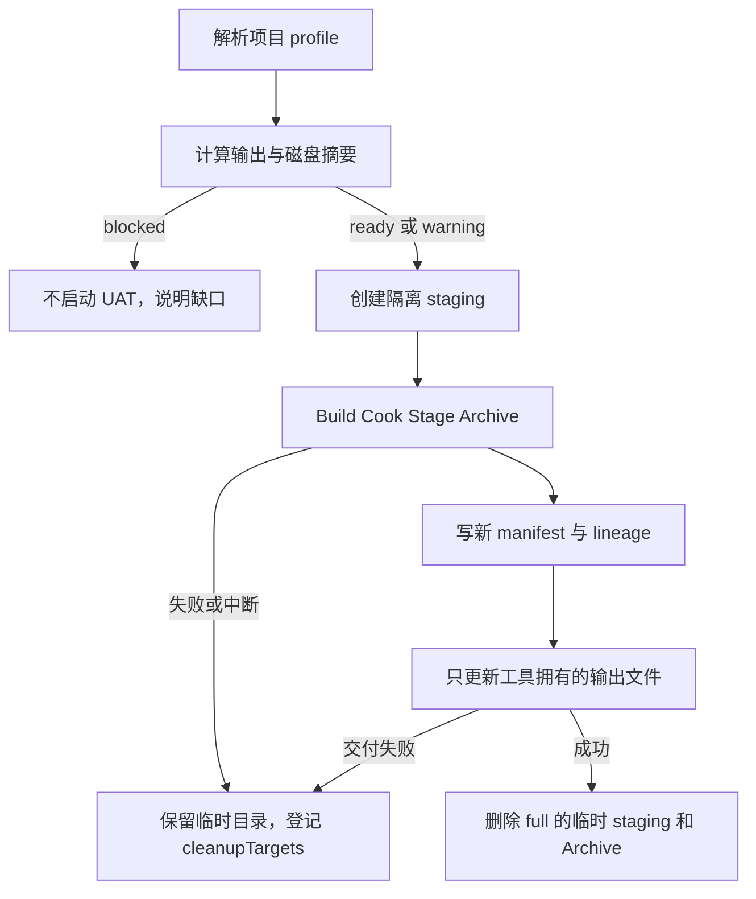

# 项目包范围与产物生命周期设计 v2

## 目标

让普通任务只产生项目包。插件包和引擎 Installed Build 只有在用户明确提出对应目标时才允许启动。让每次打包都能说明输出会增加多少空间、属于哪个源码和配置版本、失败后哪些目录可以清理。

## 背景与已确认事实

本版基于 `research/package-session-scope-research.md`。来源会话的原始任务是运行时属性覆盖，没有要求插件包或引擎包。关联 execution 记录却出现项目包 11 次、插件包 4 次、引擎包 3 次。引擎包三次都因安装版引擎缺少 `Engine/Build/InstalledEngineBuild.xml` 失败，插件包也没有形成成功交付。

当前 CLI 和旧设计把 `package project`、`package plugin`、`package engine` 作为同级入口。`design/package-design-v2.md` 还明确要求保留 plugin/engine。这个公开面没有表达“普通任务只打项目包”，因此 AI 在验证工具时有理由把所有入口当作验证范围。这是由入口设计造成的范围漏洞，不是用户需求。

当前交付代码能记录输出、日志、manifest、Junction 和恢复清单，但没有磁盘空间估算、输出版本血缘、临时目录自动回收或旧文件清理策略。版本对比时，多个约 10 GB 的项目包和超过 100 GB 的临时 staging 可以同时存在。

## 设计边界

| 场景 | 允许的目标 | 处理方式 |
| --- | --- | --- |
| 普通 task 验证功能 | 项目包 | 只进入 `package project`，使用 task 固定 profile |
| workspace 主项目发布 | 项目包 | 只进入 `package project`，使用 workspace 的项目设置 |
| 用户明确要分发插件 | 插件包 | 进入显式的高级工具链入口，单独显示风险和输出 |
| 用户明确要生成 Installed Build | 引擎包 | 进入显式的高级工具链入口，先检查源码引擎和 BuildGraph 脚本 |
| 项目包依赖插件 | 仍然是项目包 | 依赖只作为项目副本的输入，不改变打包目标 |

普通 task 的 profile 只表示项目包配方。插件包和引擎包不继承 task 的项目 profile，也不应由 `package project` 的失败自动触发。

## 方案对比

### 方案 A：保留三个同级入口，只修改 help

在 help 中标注 project 是常用入口，plugin 和 engine 是高级入口。改动小，旧脚本兼容最好，但 AI 仍能直接看到并调用两个非项目入口，范围错误仍可能发生。放弃。

### 方案 B：项目包与高级工具链分组，推荐

普通 `package` help 只突出 project、plan、check、status、clean 和 recover。插件包与引擎包移动到 `package advanced plugin`、`package advanced engine`，旧同级命令保留为隐藏兼容别名，调用时只输出迁移提示并要求用户明确进入高级入口。这样不增加日常参数，命令结构直接表达目标范围。

代价是旧的 `package plugin` 和 `package engine` 脚本需要迁移一次。保留隐藏别名可以让错误调用立即给出新命令，不会悄悄启动大任务。

### 方案 C：彻底删除插件包和引擎包

删除 parser、文档和实现，最能缩小普通工具，但会破坏已有用户可能依赖的插件构建和引擎构建能力，也无法满足以后明确的分发需求。放弃。

## 选定方案

采用方案 B。项目包是唯一的普通任务打包入口，高级工具链单独分组。AI skill 也必须写明：用户没有明确说插件包、引擎包或 Installed Build 时，不得调用高级入口；“验证打包工具”默认只验证项目包。

## CLI 语义

普通入口保持短命令：

```powershell
udf package project --task <workspace/task-id>
udf package project --workspace <workspace>
udf package plan project --task <workspace/task-id>
udf package check project --task <workspace/task-id>
```

高级入口明确写出目标：

```powershell
udf package advanced plugin AesWorld --workspace <workspace>
udf package advanced engine --workspace <workspace>
```

`package run` 只作为项目包兼容别名。普通 help 不把高级入口和 project 并列成同一种日常操作，但高级 help 必须显示前置检查、预计空间和输出位置。

`package plugin` 与 `package engine` 的兼容行为：解析器可以识别旧命令，但不直接启动 UBT 或 BuildGraph；它输出迁移提示和对应的 `package advanced ...` 命令，并返回需要用户明确选择目标的状态。这样旧脚本不会无提示地创建大目录。

## 固定配置与版本对比

task 仍只保存一份固定的项目包 profile。日常修改源码后，默认刷新同一个 `current` 输出目录。正式发布仍通过 profile 固定的 `cook.mode = "full"`，日常开发使用 `iterate`。

版本对比继续复用已有 `package configure --name`，不新增 `variant` 参数：

```powershell
udf package configure --task <workspace/task-id> --name <comparison-name> --reason "对比版本 B"
udf package project --task <workspace/task-id>
```

配置更新时，工具把旧输出、当前 profile revision、源码提交或来源摘要、Cook 模式和容器写入 package lineage。新 name 产生同级目录时，`plan` 和 `project` 都显示“将新增一个版本目录”，并显示已有同任务版本的数量和总大小。用户没有改 name 时，工具只更新当前目录，不自动创建隐藏副本。

## 磁盘空间与输出保护

`plan`、`check` 和 `project` 在启动 UAT 前统一计算并展示：

| 项目 | 内容 |
| --- | --- |
| 已有最终包 | 输出目录当前字节数和是否存在旧 manifest |
| 临时空间 | staging、Archive、日志和 iterate cache 的当前字节数 |
| 预计新增 | 根据同 profile 最近执行记录估算；没有历史时使用保守估算并标记为估算值 |
| 可用空间 | 输出卷和临时卷分别显示可用字节 |
| 同任务版本 | 当前 profile 的版本目录、大小和 lineage 摘要 |
| 决策 | `ready`、`warning` 或 `blocked`，原因写入执行记录 |

预计新增空间加上安全余量超过临时卷或输出卷可用空间时，状态为 `blocked`，不启动 UBT/UAT。接近阈值时状态为 `warning`，命令必须把风险写进 human 和 JSON 输出。阈值放在 workspace 的 package policy 中，默认保守，不能用普通项目包命令静默绕过。

最终包不因空间治理自动删除。工具只在用户明确指定的 `package clean` 范围内删除已经由 manifest 和 execution 记录证明属于工具的临时目录或版本目录。

## 临时目录和交付生命周期



full 模式成功交付后自动删除 execution 专属 staging 和 Archive，只保留最终包、manifest、必要日志和 execution 记录。iterate 只保留每个 task/profile/引擎/平台/容器组合的一份持久 cache，新的执行更新这份 cache，不按 execution 无限复制。

输出更新采用“新目录生成后再按 manifest 交付”的方式。交付时只覆盖上一份 UDF manifest 中拥有的普通文件，删除旧 manifest 中已不再生成的 UDF 文件；用户文件、外部 Junction 和未被 UDF 接管的文件继续保留。交付前后都记录字节数和文件数。

`package clean` 保留现有 execution ID 用法，并增加按 task/workspace 的临时目录查询和 dry-run。没有明确选择时不删除最终包，只报告可以回收的空间。

## 状态和记录

每个 execution 记录增加以下事实：

- `target_kind`：`project`、`advanced-plugin` 或 `advanced-engine`
- `profile_revision`、`source_revision`、`source_digest`
- `lineage_parent` 和 `lineage_label`
- `output_bytes_before`、`output_bytes_after`、`temporary_bytes_before`、`temporary_bytes_after`
- `estimated_additional_bytes`、`available_bytes`、`space_decision`
- `cleanup_policy` 和实际清理结果

旧记录按缺省值迁移为 `target_kind = project` 或 `unknown`，不能把 unknown 当作可安全删除的依据。JSON 和 human 输出都要显示实际目标，避免 status 只显示“package”。

## 正常、失败和中断场景

| 场景 | 预期行为 |
| --- | --- |
| 日常 task 改源码后再次打包 | 只打项目包，复用匹配的 iterate cache，刷新 current 输出，显示新增空间估算 |
| 用户做版本对比 | 先通过 `configure --name --reason` 建立新 lineage，plan 显示同任务版本总大小和风险 |
| 用户没有提插件或引擎 | parser 和 skill 都不会进入高级入口 |
| 用户明确要求插件包 | 只执行 advanced plugin，检查依赖和空间，不读取项目包 profile 代替插件配置 |
| 用户明确要求引擎包 | 先检查源码引擎和 InstalledEngineBuild.xml，不满足时在 UAT 前阻断 |
| UAT 失败 | 保留失败日志和临时目录，execution 标记 failed，提示精确 clean 范围 |
| 交付中断 | 保留事务日志，recover 先检查外部修改，成功后再清理临时目录 |
| 空间不足 | `blocked`，不启动长时间 Build/Cook |

## 兼容和迁移

- 现有 task project profile、full/iterate、`--name`、manifest 和 recover 继续保留。
- 现有 `package plugin`、`package engine` 不再作为普通入口执行，迁移到 `package advanced plugin/engine`。
- 旧 execution 记录只读兼容，无法证明 lineage 或空间数据时显示 unknown，不自动删除其目录。
- 不修改 UE 项目、AesWorld、引擎安装和用户最终包内容。

## 影响面

预计修改范围：`src/cli.rs`、`src/main.rs`、`src/commands/package.rs`、`src/package_profile.rs`、必要时 `src/output.rs`；新增或扩展 package lineage 和 disk policy 类型；补充 CLI taxonomy、package profile、package lifecycle、storage cleanup 测试；同步 `README.md` 和 `skills/unrealdevflow/SKILL.md`。

变更前可用 `rg --files src tests README.md skills/unrealdevflow` 统计文件范围。生产代码不触碰 UE 项目、插件或引擎目录。

## 验收条件

- AC-014：普通项目包命令和 help 不会自动进入插件包或引擎包；高级入口必须由用户明确写出目标，旧同级命令只给迁移提示，不启动 UBT/BuildGraph。
- AC-015：项目包计划和执行记录显示输出 lineage、已有字节数、临时字节数、预计新增空间、可用空间和决策；full 成功后删除 execution 临时目录，最终包和用户文件保持不变。
- 新增测试证明同 task 的版本对比必须有固定 `--name` 和 `--reason`，并能在 plan 中看到同任务版本总大小。
- 新增测试证明旧 manifest 中的 UDF 文件会被安全移除，用户文件、外部 Junction 和未接管文件不会被删除。
- 新增测试证明空间不足在 UAT 前返回 `blocked`，失败和中断场景保留可恢复证据。
- 人工验证只执行 `package project` 的 DEV_1 Development/Shipping 项目包；插件包和引擎包不作为本任务的默认验证动作。

## 未决问题

1. workspace 默认磁盘阈值取固定字节、剩余比例，还是两者取更严格值。建议同时使用最小剩余比例和最小保留字节，由实施阶段用真实 DEV_1 数据校准。
2. full 成功后是否保留最近一次 Archive 供人工诊断。建议默认删除，出现 warning 或用户指定保留时才保存。
3. 隐藏兼容别名保留几个版本。建议保留一个版本，只输出迁移提示，下一版再删除 parser 分支。
