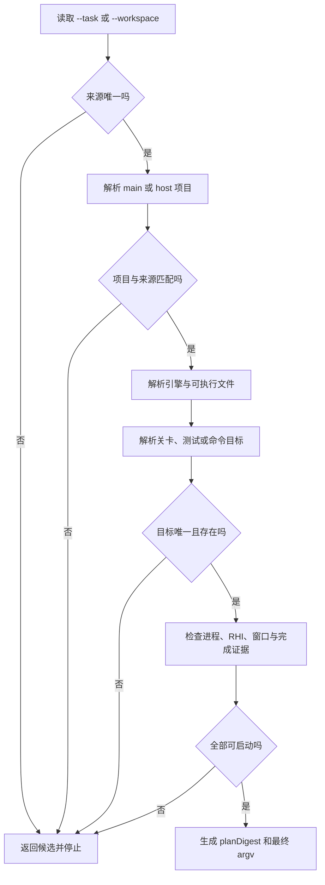
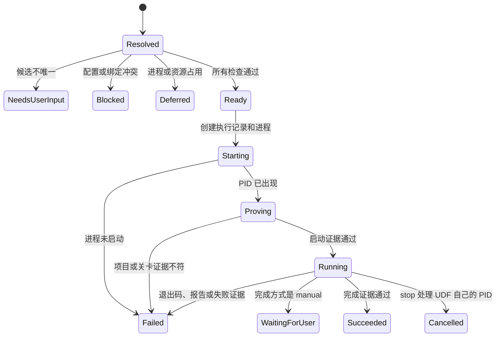

# UDF 虚幻项目运行与测试 CLI 设计

历史版本，基于 `07b7c4b`。后续使用 [v2 设计](design/run-verification-design-v2.md)。
本文件保留当时的方案，不代表 v0.5.0 的当前能力或本轮推荐。

## 要解决什么

AI 和开发者只描述要运行的 workspace 或 task、实际项目、关卡和测试目标。UDF 负责确定
UE 版本与可执行文件；参数顺序与进程冲突；日志位置与完成证据。任何关键对象有歧义时，
命令返回候选并停止，不启动一个“可能对”的 UE 进程。

来源会话证明了四类重复错误：关卡缺失后落到 `Untitled`；Git Bash 改写 `/Game/...`；
主项目和任务 Host 被交替使用；性能运行漏掉分辨率与并发 Editor 状态。调查细节见
[ue-launch-research.md](research/ue-launch-research.md)。

## 非目标

- 第一版不自动修改 Junction，也不替用户执行 `udf task switch`。
- 第一版不向任意已运行 Editor 注入控制台命令。
- 第一版不解析自由格式的整条 shell 命令。
- 第一版不代替 Gauntlet、UAT、Session Frontend 或项目自己的测试框架。
- 第一版不承诺自定义控制台命令已经完成，除非预设声明了可观察证据。

## 方案对比

| 方案 | 怎么做 | 代价 | 结论 |
| --- | --- | --- | --- |
| 新增统一的 `udf run` 组 | `editor`、`game`、`test`、`command`、`commandlet` 共用 source、plan、execution 和 evidence | 新增一个顶层组，需要扩展执行契约 | **采用。** 一次解析可以覆盖六类真实情况，预设也有稳定入口 |
| 新增 `udf launch` 和 `udf test` 两组 | 交互启动放 `launch`，Automation 与 Commandlet 放 `test` | 同一个 `.uproject`、关卡和进程检查会复制两套；自定义命令归属不清 | 不选 |
| 把命令拆进 `workspace run` 与 `task test` | 从所属对象进入运行命令 | 同一目标因入口不同产生两套参数；无法清楚表达“任务代码加主项目关卡” | 不选 |
| 保持现状 | 文档继续保存手工模板 | 来源会话已经两次重复同一个 Git Bash 错误，项目和关卡仍靠记忆 | 不选 |

## 命令结构

```text
udf run
├─ discover maps|tests|sessions
├─ check editor|game|test|command|commandlet|profile
├─ plan editor|game|test|command|commandlet|profile
├─ editor
├─ game
├─ test
├─ command
├─ commandlet
├─ profile list|show|run
├─ status [EXECUTION_ID]
└─ stop <EXECUTION_ID>
```

`check` 只回答现在能否启动。`plan` 返回最终参数和输出位置。五个动作会重新解析并保存执行记录。
`profile run` 运行一份项目预设。`status` 和 `stop` 只处理 UDF 自己创建的执行记录与 PID。

### 公共来源参数

每个动作必须给 `--workspace <name>` 或 `--task <workspace/task-id>`，两者只能选一个。
执行命令不从当前目录、最近任务或当前 Git 分支猜来源。

| 参数 | 含义 | 规则 |
| --- | --- | --- |
| `--workspace <name>` | 使用 workspace 的主项目和主插件版本 | 实际项目固定为 `main` |
| `--task <task-ref>` | 使用任务元数据冻结的插件代码 | 还要给 `--project main|host` |
| `--project main` | 运行 workspace 的真实主项目 | UDF 检查主项目 Junction 当前是否指向这个 task；不匹配就阻止 |
| `--project host` | 运行任务 Host `.uproject` | 只能使用 Host 与已挂载插件能看到的内容 |

“任务代码加主项目业务关卡”是来源会话最常见的真机情况，写法如下：

```powershell
udf run plan game `
  --task neon-dev1/perf-benchmark-toolkit `
  --project main `
  --map asset:/Game/Maps/UGA_local/aes6_sh_sz_q1
```

UDF 不执行 `task switch`。如果 `workspace status` 显示主项目没有绑定该 task，返回
`junction_mismatch` 和准确的 `udf task switch <task-ref>` 建议，等待用户授权。

### 五个运行动作

| 动作 | UE 进程 | 关卡规则 | 默认等待方式 |
| --- | --- | --- | --- |
| `editor` | `UnrealEditor.exe`，不带 `-game` | `--map` 可选；不给时解析 `EditorStartupMap` 并展示来源 | 后台；等项目和关卡日志证据出现后返回 |
| `game` | `UnrealEditor.exe`，带 `-game` | `--map` 可选；不给时解析 `GameDefaultMap` | 后台；等 `Browse` 命中目标关卡后返回 |
| `test` | `UnrealEditor-Cmd.exe` | 默认无关卡；需要关卡的测试显式给 `--map` | 前台；等报告与进程退出 |
| `command` | 根据 `--context editor|game` 选择模式 | 默认 `--world required`，必须解析出关卡；可改成 `optional` 或 `none` | 按完成证据等待 |
| `commandlet` | `UnrealEditor-Cmd.exe -run=<name>` | 禁止关卡；Commandlet 环境没有 World 和 Actor | 前台；等退出码与声明的制品 |

### 六类情况的完整写法

| 情况 | 示例 | UDF 需要证明什么 |
| --- | --- | --- |
| 交互式 Editor | `udf run editor --workspace neon-dev1 --map asset:/Game/Maps/UGA_local/aes6_sh_sz_q1` | PID 的命令行指向解析出的项目；日志加载目标关卡 |
| 指定关卡的 Launch Game | `udf run game --task neon-dev1/perf-benchmark-toolkit --project main --map aes6_sh_sz_q1 --windowed --res 1366x1024` | task 绑定正确；短名只命中一个关卡；实际分辨率与计划一致 |
| Automation | `udf run test --task neon-dev1/perf-benchmark-toolkit --project host --filter AesWorld.PerfLab` | 过滤条件命中测试；报告记录数量与成败；退出码可信 |
| 自定义控制台命令 | `udf run command --task neon-dev1/perf-benchmark-toolkit --project main --context game --map aes6_sh_sz_q1 --exec "AesPerfLab.LayerTile.Diagnose -Mode=Auto" --complete file:Saved/Profiling/.../diagnosis.json` | 命令已被 UE 接收；声明的完成文件出现；文件属于本次 execution |
| Commandlet | `udf run commandlet --workspace neon-dev1 --name ResavePackages --ue-arg=-PackageFolder=/Game/AesWorld` | Commandlet 存在或引擎接受；没有混入 game、map、ExecCmds 参数 |
| 已有 Editor | `udf run check command --workspace neon-dev1 --session 28360 --exec "AesPerfLab..."` | PID 与项目匹配；没有桥接能力时返回 `needsUserInput` 和可复制命令，不声称已发送 |

## 解析模型

现有 `SourceContext` 适合 build 和 package。run 需要额外表达实际项目、UE 模式和运行目标：

```text
RunContext
├─ source                 # task 或 workspace，代码从哪里来
├─ runtimeProject         # main 或 host，实际打开哪份 .uproject
├─ engine                 # 根目录、版本、来源
├─ executable             # UnrealEditor 或 UnrealEditor-Cmd
├─ target                 # map、test filter、console command 或 commandlet
├─ environment            # RHI、窗口、分辨率、并发进程
├─ completion             # 进程、日志、文件、报告或人工
└─ argumentSources[]      # 每个最终参数从 CLI、预设、workspace 或项目配置中的哪里来
```

### 来源解析优先级



具体优先级如下：

1. `--task` 使用 `.udf-meta.json.context` 的 workspace、主项目、引擎和插件版本。
2. `--workspace` 使用当前 workspace 配置。
3. task 的 `--project main` 必须和 workspace 主项目相同；`--project host` 必须是该 task 的规范 Host。
4. 引擎取 task 冻结值或 workspace `engine_path`。缺失时才读 `UNREALDEVFLOW_UE_ENGINE_ROOT` 和
   `.uproject` 的 `EngineAssociation`。两个来源给出不同引擎时返回 `engine_mismatch`。
5. 可执行文件由动作决定，调用方不能用 `--ue-arg` 换掉 executable 或 mode。

## 关卡发现与选择

### 输入形式

| 输入 | 例子 | 用途 |
| --- | --- | --- |
| shell 安全资产 URI | `asset:/Game/Maps/UGA_local/aes6_sh_sz_q1` | 跨 PowerShell、cmd 和 Git Bash 的推荐写法 |
| long package name | `/Game/Maps/UGA_local/aes6_sh_sz_q1` | PowerShell 与 cmd 可直接使用；UDF 仍检查异常 Windows 前缀 |
| 短查询 | `aes6_sh_sz_q1` | `discover maps` 搜索项目与已启用内容插件 |
| 配置默认 | `default` | 显式接受 `EditorStartupMap` 或 `GameDefaultMap` |

项目 `Content/X.umap` 映射为 `/Game/X`。带内容插件的 `Content/X.umap` 映射为
`/<PluginName>/X`。UDF 先做只读文件扫描；遇到重定向、虚拟资产或多个挂载候选时，启动目标引擎的
只读发现探针。零候选返回 `map_not_found`，多个候选返回 `ambiguous_map`。

UDF 用参数数组把最终 `/Game/...` 传给 UE。`asset:` 只存在于 UDF 输入，最终参数仍遵守 Epic 的
关卡 URL 格式。若收到 `C:/Program Files/Git/Game/...` 这类已被 MSYS 改写的值，UDF 返回
`shell_path_mangled`，同时给出 `asset:/Game/...` 候选。

启动成功的判据包含引擎日志中的 `Browse Started` 或 `LoadMap`。日志里的 long package name 必须和
计划一致。只看到 PID 存活不算关卡加载成功。

## Automation 测试

`udf run discover tests` 会启动一个短生命周期的 `UnrealEditor-Cmd.exe` 探针，加载目标项目的测试模块，
返回完整测试名、组、应用环境和发现日志。`check test` 默认刷新发现结果，调用方也可以用
`--discovery-cache <id>` 固定一次结果。

| 参数 | 行为 |
| --- | --- |
| `--filter <name>` | 精确名、命名空间前缀或 `Group:<name>` |
| `--exact` | 只接受一个完整测试名 |
| `--allow-suite` | 明确允许前缀命中多条测试 |
| `--rhi real|null` | 默认 `real`；调用方确认测试不依赖视口、GPU 或渲染结果后才能选 `null` |
| `--report <dir>` | 覆盖报告目录；默认放 execution 目录 |
| `--resume <execution-id>` | 在报告支持时继续未运行项目 |

UDF 按引擎版本适配 `Automation RunTest`、退出条件和报告参数。实现探针会确认 UE 5.5 对
`RunTest` 与 `RunTests` 的行为。JSON 结果从 Automation 报告读取测试总数、通过、失败、跳过和未运行，
不会只靠日志里 `Result={Success}` 的行数。

`-NullRHI` 只代表不创建真实渲染设备。任何性能、截图、材质、视口或 GPU 结论都要求 `--rhi real`。
计划会把这个限制写进 `checks`。

## 自定义控制台命令与完成证据

`--exec` 可以重复，UDF 负责按目标 UE 版本生成 `-ExecCmds`。每个值只是一条 UE 控制台命令，
不能带项目路径、关卡 URL或第二个 `-ExecCmds=`。

完成方式必须选一个：

| 完成方式 | 适用情况 | 成功条件 |
| --- | --- | --- |
| `process-exit` | 命令自己退出 UE | UDF 拿到退出码，且启动证据已经通过 |
| `log:<literal>` | 命令写稳定完成日志 | 本次专用日志出现完整字面量 |
| `file:<project-relative-path>` | 命令生成报告或数据 | 文件在启动后创建或更新时间晚于 execution 开始 |
| `automation-report` | Automation | 报告完整且没有未完成测试 |
| `manual` | 交互 Editor 中人工查看 | execution 保持 `waitingForUser`，不写 `succeeded` |

命令只在日志出现 `Cmd: ...` 时标记为 `accepted`。`accepted` 与 `succeeded` 是两个状态。
超时后 UDF记录 `completion_timeout`，保留 PID、日志和已经出现的制品，不自动杀掉非 UDF 进程。

## 已有 Editor 会话

`udf run discover sessions` 返回以下内容：PID 与可执行文件；项目与命令行；启动时间；是否由 UDF 管理。

第一版只允许三种结果：

| 会话状态 | UDF 行为 |
| --- | --- |
| PID 与项目不匹配 | `project_mismatch`，停止 |
| PID 与项目匹配，但没有注册桥接能力 | `needsUserInput`，输出可复制的控制台命令与人工完成项 |
| PID 与项目匹配，且以后版本注册了桥接能力 | 计划明确写出 bridge 名称、权限和返回证据后才允许发送 |

Session Frontend 能调度 Automation，但 Epic 当前公开文档没有给任意命令注入的通用 CLI。
本设计不把窗口存在误报成命令已经执行。

## 进程与性能环境

UDF 在 `check` 中读取所有 `UnrealEditor.exe` 与 `UnrealEditor-Cmd.exe` 的 PID 和命令行。

| 情况 | 默认结果 |
| --- | --- |
| 同一项目已有 Editor，动作是 `editor` | `deferred`，返回已有 PID；显式 `--new-instance` 才新开 |
| 主项目没有绑定所选 task | `blocked`，返回 `junction_mismatch` |
| Automation 使用 `null` RHI，另有交互 Editor | 警告，不阻止 |
| 真机性能预设声明 `exclusive = true`，机器上还有任何真实 RHI UE 进程 | `deferred`，列出 PID 与项目 |
| 普通 game 运行遇到其他项目 | 警告；显式 `--exclusive` 可改成 `deferred` |

性能运行还要固定并记录窗口模式与分辨率；RHI 与 GPU 适配器；并发 UE PID；项目版本与插件版本。
两次结果缺少任一可比字段时，UDF 返回 `notComparable` 和差异项。

## 项目预设

反复使用的长命令写成项目预设。项目共享预设放在 `<project>/.unrealdevflow/run.toml`，只保存
资产名、测试过滤条件、模式和完成证据，不保存本机绝对引擎路径。用户级覆盖放在
`~/.unrealdevflow/run-profiles/<workspace>.toml`，只保存窗口位置、GPU 或本机日志根目录。

```toml
[profiles.perf-lab-precise]
action = "command"
project = "main"
context = "game"
map = "asset:/Game/Maps/UGA_local/aes6_sh_sz_q1"
exec = ["AesPerfLab.LayerTile.Diagnose -Mode=Auto -Speed=Precise -QuitWhenDone"]
rendering = "required"
window = "windowed"
resolution = "1366x1024"
exclusive = true
timeout_seconds = 1800
completion = "file:Saved/Profiling/AesPerfLab/LayerTileDiagnosis/${execution.id}/diagnosis.json"
```

```powershell
udf run check profile perf-lab-precise --task neon-dev1/perf-benchmark-toolkit
udf run plan profile perf-lab-precise --task neon-dev1/perf-benchmark-toolkit
udf run profile run perf-lab-precise --task neon-dev1/perf-benchmark-toolkit
```

参数优先级依次是 CLI；用户覆盖；项目预设；workspace 配置；项目 `.ini`。每个最终参数都保存
`value` 和 `origin`。CLI 覆盖预设后会生成新的 `planDigest`。

## check、plan、执行与 status



- `check` 返回 `ready | needsUserInput | blocked | deferred`，不生成 plan 或 execution 文件。
- `plan` 返回完整 argv、输出位置、检查结果和 `planDigest`，不启动进程。
- 执行动作重新解析。传了 `--plan-digest` 时，现场计划不同就返回 `plan_changed`。
- `status` 只读 `~/.unrealdevflow/executions/run/<execution-id>.json`，并刷新 UDF 所有 PID 的状态。
- `stop` 只接受 execution ID，只停止该记录里的 UDF 所有 PID，并保留日志与状态。

## JSON 契约

所有命令继续使用 `src/output.rs` 的 `command/ok/data/error/messages` 信封。`plan` 的 `data`
至少包含下列字段：

```json
{
  "domain": "run",
  "action": "game",
  "readiness": "ready",
  "source": {
    "sourceRef": {"kind": "task", "value": "neon-dev1/perf-benchmark-toolkit"},
    "workspace": "neon-dev1",
    "runtimeProject": "main",
    "project": "F:\\ShanghaiP4\\neon\\UGA\\DEV_1\\UGA.uproject",
    "engine": "C:\\Program Files\\Epic Games\\UE_5.5",
    "host": "F:\\ShanghaiP4\\neon\\Hosts\\W-neon-dev1\\T-perf-benchmark-toolkit_Host"
  },
  "target": {
    "kind": "map",
    "input": "asset:/Game/Maps/UGA_local/aes6_sh_sz_q1",
    "resolved": "/Game/Maps/UGA_local/aes6_sh_sz_q1",
    "origin": "cli",
    "candidates": []
  },
  "environment": {
    "rhi": "real",
    "window": "windowed",
    "resolution": {"x": 1366, "y": 1024},
    "exclusive": true,
    "conflictingProcesses": []
  },
  "completion": {"kind": "file", "value": "Saved/Profiling/.../diagnosis.json"},
  "steps": [
    {
      "id": "launch",
      "executable": "UnrealEditor.exe",
      "argv": ["UnrealEditor.exe", "...\\UGA.uproject", "/Game/Maps/...", "-game", "-windowed", "-ResX=1366", "-ResY=1024"]
    }
  ],
  "argumentSources": [
    {"argument": "-game", "origin": "action:game"},
    {"argument": "-ResX=1366", "origin": "profile:perf-lab-precise"}
  ],
  "planDigest": "md5:...",
  "checks": [],
  "outputs": []
}
```

执行结果增加这些字段：`executionId` 与 PID；开始与结束时间；退出码；实际项目与关卡；
测试报告；日志；制品；逐条证据。`ok: true` 只表示命令调用成功；运行结果由 `data.state` 表达。

## 稳定错误码

| 错误码 | 触发条件 | 返回内容 |
| --- | --- | --- |
| `ambiguous_workspace` | 多个 workspace，调用方没给来源 | workspace 候选 |
| `source_project_mismatch` | task 与实际项目不属于同一 workspace | 两边路径与 task context |
| `junction_mismatch` | 主项目没有绑定所选 task | 当前 task、目标 task、switch 建议 |
| `engine_mismatch` | task、workspace、环境变量或 EngineAssociation 冲突 | 每个候选和来源 |
| `map_not_found` | 目标项目看不到关卡 | 搜索根与相近候选 |
| `ambiguous_map` | 短名命中多张关卡 | 所有 long package name |
| `shell_path_mangled` | `/Game/...` 已变成 Git 安装目录下的路径 | `asset:` 修正值 |
| `test_not_found` | 过滤条件零命中 | 发现日志与相近测试 |
| `unsafe_ue_arg` | 原始参数尝试覆盖项目、关卡、模式或 executable | 冲突参数与对应类型参数 |
| `existing_session_unsupported` | 已有 Editor 没有命令桥接能力 | PID、项目、可复制命令 |
| `exclusive_resource_busy` | 独占运行遇到真实 RHI UE 进程 | PID、项目和命令行 |
| `launch_verification_failed` | PID 出现，但日志项目或关卡不符 | 计划值、实际值和日志路径 |
| `completion_timeout` | 完成证据超时 | PID、日志、已有制品和继续观察命令 |
| `plan_changed` | 现场计划和传入摘要不同 | 旧摘要、新摘要和差异字段 |

## 原始 UE 参数边界

`--ue-arg <value>` 可以重复，用于 UDF 还没建模的普通开关。下列内容拒绝透传：

- 第二个 `.uproject` 或关卡 URL。
- `-game`、`-server` 或 `-run=`。
- `-ExecCmds=`、`-abslog=` 或 `-ReportExportPath=`。
- `-ResX/-ResY` 或 executable。

调用方要使用对应的类型参数。

UDF 不经过 shell 拼接。每个参数作为独立字符串交给 Windows 进程 API。human 输出可以显示一条
PowerShell 预览命令，执行事实仍以 `argv` 数组为准。

## 影响面

预计修改 6 个现有生产文件，新增 3 个生产模块，补 4 组测试，并同步 4 份用户入口文档。
实施计划要以当时的仓库结果复算：

```powershell
rg -n "Commands|BuildAction|PackageAction|OutputFormat|emit\(|emit_failure" src tests
rg -n "resolve_uproject|resolve_engine_root|ExecutionDomain|ExecutionAction|SourceContext" src tests
rg -n "UeCommand|UnrealEditor|UnrealEditor-Cmd|Automation|ExecCmds|\.uproject|map" src tests docs AGENTS.md README.md
rg -n "package check|package plan|build check|build plan|readiness|plan_digest" src tests
```

| 范围 | 预计入口 |
| --- | --- |
| CLI 与派发 | `src/cli.rs`、`src/main.rs` |
| 共享执行契约 | `src/execution.rs`、`src/source_context.rs` |
| UE 参数构造 | `src/ue_commands.rs` |
| 进程信息 | `src/editor.rs` |
| 新运行实现 | `src/commands/run.rs`、`src/run_context.rs`、`src/run_discovery.rs` |
| 测试 | `tests/cli_taxonomy.rs`、`tests/execution_contract.rs`、新增命令与生命周期测试 |
| 文档 | `README.md`、`AGENTS.md`、`CLAUDE.md`、两份安装 skill |

## 实施分段

| 段 | 内容 | 可验结果 |
| --- | --- | --- |
| 1 | `run check/plan`、来源与项目拆分、Editor executable、参数数组、JSON | 不启动 UE 就能稳定得到同一份计划 |
| 2 | 关卡发现、editor/game、启动日志核对、进程记录 | Git Bash、短关卡名、错误项目和重复 Editor 用例通过 |
| 3 | Automation 发现与报告、commandlet | 主项目与 Host 测试矩阵通过，真实报告可读 |
| 4 | 自定义 command、完成证据、status/stop | 文件、日志、进程与人工四类完成方式通过 |
| 5 | 项目预设与用户覆盖 | 来源会话的 PerfLab Fast/Precise 命令不再手工拼接 |

## 验收对应

| 验收项 | 设计位置 |
| --- | --- |
| AC-001 | “要解决什么”与调查记录中的真实失败样本 |
| AC-002 | “六类情况的完整写法” |
| AC-003 | 各动作、解析模型、完成证据、错误码和恢复内容 |
| AC-004 | `check`、`plan`、JSON 契约 |
| AC-005 | 公共来源参数、来源解析优先级、关卡与进程规则 |
| AC-006 | 方案对比与影响面 |
| AC-007 | 写作检查和 workflow 校验在交付前执行 |

## 等用户确认的决定

| 推荐 | 代价 | 选择后怎么走 |
| --- | --- | --- |
| **采用 `udf run`，第一版对已有 Editor 只检测并输出人工命令** | 已开 Editor 不能由纯 CLI 自动执行任意控制台命令 | 设计标为 `accepted`，进入实现计划；桥接另开设计 |
| 采用 `udf run`，本任务同时实现 Editor 命令桥接 | 需要选择 MCP、Remote Control 或自带插件，范围和安全面都会增加 | 设计保持 `proposed`，先补桥接调查 |
| 改成 `launch` 与 `test` 两个顶层组 | 参数与执行记录要拆成两套 | 重写命令结构后再评审 |
