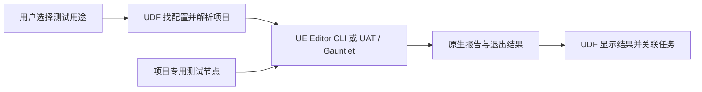

# UDF 原生运行与测试入口设计 v3

## 要解决的问题

下一次会话遇到同类测试，能找到已经用对的配置，选中正确工程和关卡，调用 UE 原生工具并读懂结果。
成功标准是减少重复探索与错误命令，不要求建立完整环境快照或自动证明修复因果。

基线为 UDF v0.5.0、dev 2a516b5。本版取代 v2；命令和 JSON 都是待实现接口。本轮只交付设计，原生 Gauntlet 尚未在案例 Host 上实跑。
用户已认可原生工具优先及范围收窄方向；本版细节由设计评审检查。
2026-09-05 用户要求“写为施工计划”，本版据此转为 accepted。施工细化和产品验收见 [plan.md](../plan.md)。
施工前只读复查发现：历史 earthmodeler-exit-crash Host 已不存在；主项目 UGA.uproject 与指定地图仍存在。历史日志保留，后续创建专用验收 Host 作为新样本，不声称还原了旧环境。

## 真实问题怎样对应到设计

| 已发生的问题 | 本版解决方式 |
| --- | --- |
| 会话 A 漏传地图，采集到 Untitled，valid=0 | 按测试用途保存精确地图；性能配置必须有地图，纯启动 smoke 可不要求 |
| Git Bash 两次把 /Game 转成 C:/Program Files/Git/Game | 地图从配置读取，直接构造原生参数；实现时验证 UE 实收值 |
| Automation 在主项目与 Host 之间临时切换 | 配置显式声明 main/host，按 task/workspace 解析并展示绑定 |
| 性能采集从 1366×1024 变成 1920×1080 | 只在性能用例固定窗口和分辨率，不要求全项目环境快照 |
| 已有另一个约 11 GB 的 Editor 实例，启动前才临时查进程 | 预检列项目与 PID，已有实例提供原生操作路线 |
| EarthModeler 业务命令已返回，退出仍崩溃 | 业务与退出结果分开；严格退出规则放在 Gauntlet 节点 |

来源位置与原始结果见 [会话 A 调查](../research/ue-launch-research.md) 和 [退出案例调查](../research/lifecycle-and-dev-research.md)。
历史调查中的旧版 UDF 接口与 v2 扩展建议只作过程证据；当前接口和范围以本版为准。

## 分工与方案选择



| 方案 | 代价和适用范围 | 决定 |
| --- | --- | --- |
| UDF 配置入口 + UE 原生执行 | 补任务绑定、用法列表和结果关联，复杂测试沿用原生扩展点 | 采用 |
| 直接维护 UE 命令文档和 Launcher Profile | 最少代码；任务路径仍由会话填写，错误组合仍可能重复 | 作为可直接使用的原生出口，单独使用不足以覆盖已有选错 task 问题 |
| v2 自建运行与验证系统 | 重复 Gauntlet 进程、超时、日志解析能力，需要维护额外状态和快照 | 本任务不采用 |

| 职责 | 负责人 |
| --- | --- |
| task/workspace 到项目与插件路径的解析 | UDF 现有配置、task context 与 Junction 检查 |
| 某种测试应该用哪个原生入口、哪张地图和哪些参数 | 项目维护的运行配置；UDF 列出并复用 |
| 引擎内 Automation 测试 | UE Automation 与 UE.EditorAutomation |
| 测试进程、超时、日志和通用崩溃解析 | Gauntlet |
| 普通 Editor/Game 启动 | UnrealEditor 原生 CLI |
| 资产批处理 | 原生 Commandlet |
| Details 状态、Settings 返回值、异步采集结束等业务规则 | 项目现有测试或最小 Gauntlet 测试节点 |

源码及官方证据见 [原生工具调查](../research/native-tools-research.md)。Project Launcher 已有的配置继续有效，首版不实现完整导入/转换器；需要 CLI 复用时只登记当前任务实际用到的参数。

## 精简命令面

```text
udf run list      --workspace W | --task TASK
udf run configure NAME --workspace W | --task TASK --file FILE [--reason TEXT]
udf run check     NAME --workspace W | --task TASK
udf run plan      NAME --workspace W | --task TASK
udf run start     NAME --workspace W | --task TASK
udf run status   [EXECUTION_ID] [--workspace W | --task TASK]
udf run compare  BEFORE_ID AFTER_ID [--expect pass-after-fail]
```

所有命令支持现有 `--format json`。执行入口使用已保存的配置名，让会话少传参数。configure 是唯一配置写入口；简单表单可由内置模板生成候选文件，不另开 profile 子树。

| 命令 | 结果与副作用 |
| --- | --- |
| list | 只读，显示配置名、用途、必需输入、原生入口和最近一次验证结果；没有配置时列出可选原生模板 |
| configure | 校验并保存完整配置，记录修改原因与 revision；不会把新配置自动标成已验证 |
| check | 只读，检查项目、工具、配置和已知前提；缺少真实运行证据不冒充测试通过 |
| plan | 只读，显示实际引擎、项目、关卡要求、原生参数与结果路径模板；输出可直接使用的原生命令 |
| start | 使用同一解析逻辑重新检查并执行；测试默认前台等待原生工具结束 |
| status | 查询已保存的调用结果与原生报告；PID 消失不填一个退出码 0 |
| compare | 展示两次运行的命令、结果与已知环境差异；可选判定是否从失败变为通过 |

check 延续 ready/needsUserInput/blocked/deferred 四态。plan 不输出动态 readiness，不创建执行记录。
首版不增加独立 discover 服务、后台测试守护进程、wait/stop 协议或远程队列。测试调度与超时使用原生工具，长时间任务由已有终端或 CI 持有。

## 配置如何跨会话复用

task 配置位于 `<Host>/.udf/run/<name>.json`；workspace 配置位于 UDF 配置目录 `workspaces/<name>/run/<name>.json`。
可版本管理的候选文件留在项目自己的测试目录，configure 将其登记到所选范围。共享文件使用逻辑路径，机器上的引擎和实际项目由 workspace/task 解析。

任务查找先用 task 中的同名完整配置，否则使用所属 workspace 中的完整配置。只做整份选择，不合并字段。list 和 plan 明确显示来源；宿主不满足继承配置时返回不适用。
这样新会话只需 list 找用途，再 plan 核对，之后 start。退出任务与性能任务不需要共享一份万能配置。

最小配置字段：说明与用途；project=main/host；backend=editor/commandlet/gauntlet；对应原生参数。
三个 backend 使用封闭的参数结构，不把 shell 字符串当脚本执行。配置保持 revision 与摘要，防止误覆盖；这些小文件摘要不扩展为项目内容或 DLL 快照。

候选文件使用 `schemaVersion=1`，公共字段为 description、useWhen、project、backend 和可选 map。
backend 只允许一个同名参数对象，各字段如下：

| backend | 参数字段 |
| --- | --- |
| editor | mode、rhi、window、nativeArgs |
| commandlet | name、nativeArgs |
| gauntlet | test、build、platform、configuration、nullRhi、unattended、execCmds、maxDurationSeconds、runTest、nativeArgs |

nativeArgs 是逐项参数数组，仅允许项目参数，不能重复或覆盖受控的项目、地图、运行模式、RHI 与退出参数。
gauntlet.nativeArgs 用于原生测试节点的扩展参数，同样禁止覆盖已有受控字段；不在 JSON 中定义测试步骤或断言。revision、摘要及验证结果由 UDF 维护，不要求候选文件伪造这些字段。

UE.EditorAutomation 必须提供非空 runTest，映射到单个 `-RunTest=<过滤条件>` 参数；没有输入时 check 返回 needsUserInput。
例如 `"test": "UE.EditorAutomation", "runTest": "Group:AI"` 映射为 `-test=UE.EditorAutomation -RunTest=Group:AI`。Group:AI 来自原生示例，具体项目仍须通过原生测试列表确认匹配项；零匹配不能报告测试通过。

示例见 [editor-exit-native-v3.json](../assets/editor-exit-native-v3.json) 与 [perflab-game-native-v3.json](../assets/perflab-game-native-v3.json)。
前者保存同步触发命令和自然退出要求，后者保存实际地图及窗口参数。它们是候选配置，不表示已通过 UDF 实测。
退出示例引用的 `Udf.EditorExit` 尚未实现，自然退出要求来自这个测试节点的契约；节点在同步 execCmds 之后添加 QUIT_EDITOR。120 秒是候选超时，不是既有实测值。既无可加载节点也无 UAT 可编译的随附节点源码时，示例不可执行。
普通 editor backend 始终只报告 started；即使 nativeArgs 发出了命令，也不自动产生业务通过结论。需要测试结论时改用具有明确判据的原生测试入口。

每次成功测试保存配置版本与实际执行结果。list 的“最近验证”只绑定那次配置、引擎和目标，不宣称永远有效。配置改变后显示待验证；首次执行不因没有历史验证记录而被阻止。

## 六类使用情况

| 场景 | 采用的原生入口 | 必需配置与结果 |
| --- | --- | --- |
| 打开交互 Editor | UnrealEditor.exe | 项目、可选启动地图；返回 started，表示进程已启动，不是测试通过 |
| 指定关卡 Launch Game | UnrealEditor.exe -game | 精确地图；性能场景另存分辨率和 real RHI；返回启动信息与原生日志位置 |
| Automation | RunUAT RunUnreal + UE.EditorAutomation | 原生测试过滤条件，UAT 结果与 Automation 报告；不复制一套测试发现框架 |
| 自定义命令测试 | 项目已有 Gauntlet 节点或 Editor CLI | 同步命令可直接执行；需要业务完成判据或异步等待时，由项目测试节点负责 |
| 无界面/退出验证 | EditorBootTest 或最小 EditorExit 节点；明确指定 null RHI | 实际进程退出与原生 crash 判定；无界面不等于 Commandlet |
| 已打开的 Editor | 现有 Session Frontend、项目控制接口，或给出控制台命令 | 首版只核对目标并给出原生操作路线；未连接控制接口时不声称已执行 |

Commandlet 另作为通用 backend，直接映射 `UnrealEditor-Cmd.exe -run=<name>`。具体 Commandlet 的输入和成功条件由它自身定义。
测试名通过已有 Automation 工具发现；UDF 保存已选入口。关卡候选可枚举 Content 中的 umap；复杂挂载和重定向交给原生资产工具确认后登记，不构建新的资产数据库。

已有 Editor 路线由 `plan NAME --existing-editor [--pid PID]` 选择，仅给操作指引，不执行测试。它从所选配置解析项目，再列出匹配实例的 PID 和项目路径；多个匹配且未选 PID 时返回候选。
plan 的 existingEditor 包含 candidates、selectedPid、targetMatch、currentMap 和 actions；无法读取当前关卡时 currentMap=null，不把启动参数当作当前 Editor 状态。
actions 给出该配置对应的 Session Frontend 步骤或可复制控制台命令；需要尚不存在的项目接口时明确注明。start 不接受 existing-editor 参数；普通 Editor 启动若已存在匹配实例，预检提示这条已有实例路线，不自动另开一个。

## 目标与参数的必要检查

1. 执行必须指定 workspace 或 task。task 使用冻结 context，main/host 由配置明确选定；不按最近会话猜。
2. 运行 main 时只读检查当前插件绑定，若与 task 不符，返回具体目标和已有 switch 流程，不自动改 Junction。host 缺主项目地图时不悄悄换项目。
3. engine 优先用已有 workspace/task 解析规则，默认不增加第二套版本解析。
4. 地图是有用途的精确选择，短名同名时列候选；配置固定后不再每轮搜索。启动 smoke 可以声明不要求地图，Untitled 对该场景合法。
5. 参数由 UDF 构造成原生参数数组并正确转义。Git Bash 调用方主要传配置名，长 `/Game/...` 从配置读取；跨 shell 到 UE 的解析必须有真实验证。
6. 模式、RHI、分辨率和退出方式冲突时拒绝，不能用额外参数覆盖解析出的项目。未知项目参数保留原生形式，但不接受 shell 拼接语句。

通用结果只记录实际项目、引擎标识和运行参数；能取得时附源码版本。二进制存在性与引擎加载兼容仍要检查，但不要求每次算所有 DLL 的哈希。
相机、分辨率、Actor 选择等前提仅在依赖它的测试中配置；不收集所有项目的完整布局、环境与内容快照。

## 退出崩溃案例如何落到原生工具

案例项目为 `neon-dev/earthmodeler-exit-crash` 的 Host。已有复现命令是 Cmd 外壳加 `stat unit, QUIT_EDITOR` 和 null RHI，前后 UE 退出码为 3 和 0。
原始记录见 [退出案例调查](../research/lifecycle-and-dev-research.md)。待办提供过测试环境信息，但当前旧 Host 已不在；后续使用施工计划指定的新验收 Host，基础测试不等待完整环境快照。

实施时按下面顺序收敛：

1. 先在现有 Host 试原生 UE.EditorBootTest，确认 UAT/Gauntlet 可用，以及真实 Editor 退出路径与旧命令的差异。
2. 对照旧命令，确认 Cmd 外壳、null RHI 和 stat unit 是否影响复现；不能把不同命令的结果标成同条件对照。
3. 如要保留触发命令及“必须自然退出”，增加一个最小 `Udf.EditorExit` Gauntlet C# 节点。该名称是拟新增接口；缺少可加载程序集和随附源码时 check 报缺失，不自动退成较弱测试。已有随附源码时，check 只检查编译前提，start 交给 UAT 原生编译加载；首次运行由施工探针验证。
4. 节点通过原生角色配置执行命令，复用 Gauntlet 的 Fatal/Ensure/制品处理。strict 通过须同时满足：已自然终止、WasKilled=false、原始 UE 退出码为 0、原生判定无致命失败。原始码非零为 failed，缺失为 unknown；已知 Fatal 或强杀仍为 failed。节点负责这些规则与结果导出。
5. 保存前后两次调用和报告，展示“上次崩溃、本次通过”。默认不宣称自动证明代码修改是唯一原因。

引擎进程监控、超时和退出清理仍由 Gauntlet 完成。UDF 只等待原生执行入口，并保存有限调用记录；不会再写一个替代 Gauntlet 的监督框架。
同步命令可以排在退出前，任意异步命令不套这个节点。异步测试使用项目节点或插件自身完成机制，配置不满足时给出明确缺口。

原生 EditorBootTest 和 Udf.EditorExit 分开列出。前者按原生规则报告 boot 测试结果，后者才承诺严格自然退出。
本机 Gauntlet 默认判定可能接受某些受控强杀，且归一化 ExitCode 不等于原始 UE 退出码，不能直接把它叫 clean-exit。

普通 Error 与致命崩溃保持区分。已有修复后日志的 74 行 Error 不自动使退出测试失败；内容健康和 Settings 值验证属于各自测试。
若某个退出缺陷确实需要选中 Actor，项目用例准备该状态。未准备时只报告 smoke 覆盖，不为此建立全局状态快照系统。

## 结果与最小运行记录

保存到 `executions/run/<id>.json`：配置名及版本、已解析目标、最终原生命令、开始/结束时间、toolExitCode、可用的 ueExitCode、原生结果及日志/报告路径。
轻量记录沿用现有 package 的保存方式并保证写入完整，不引入事件数据库或多阶段恢复协议。

| 情况 | UDF 返回 |
| --- | --- |
| 原生测试报告通过且工具成功结束 | passed，保留原生依据 |
| 报告或工具明确失败 | failed，返回 execution ID 与报告位置 |
| 只有进程创建成功 | started；testResult 为空 |
| 工具中断、无最终报告或状态不明 | unknown，不由进程消失推断成功 |
| 自然退出通过但业务未定义判据 | exitResult=passed，businessResult 为空 |
| Settings 值正确、随后退出崩溃 | businessResult=passed，exitResult=failed，总体 failed |

toolExitCode 是 UAT 或直接启动程序的真实返回值；ueExitCode 仅在工具明确提供原始 UE 状态时填写，缺失为 null，不从 Gauntlet 的归一化结果反推。
普通 UDF JSON 继续使用 command/ok/data/error/messages。失败结果也保留 data，避免当前 emit_failure 丢掉执行信息；只扩展 run 输出，不破坏已有命令。
`--format json` 的 stdout 只输出一份 UDF JSON 文档；原生 UAT/UE 的实时输出写日志或 stderr，不能混进 JSON。
start 的测试失败或 unknown 返回非零，CLI 语法错误沿用 2。status、list、check、plan 查询本身成功仍返回 0；check readiness 由调用方读取。交互启动返回 0 只说明 started。

各叶子命令的稳定 data 字段如下；缺失的事实填 null，不靠展示文案传递机器状态。

| 命令 | data 字段 |
| --- | --- |
| list | configurations、templates；每项包含 name、source、useWhen、requiredInputs、backend、lastValidation |
| configure | name、scope、path、revision、digest、validationState |
| check | name、readiness、reasons、resolvedTarget；reasons 包含 code 与 nextAction |
| plan | name、source、resolvedTarget、nativeExecutable、nativeArgv、displayCommand、resultPathTemplate、existingEditor |
| start/status | executionId、state、testResult、exitResult、businessResult、toolExitCode、ueExitCode、artifacts |
| compare | beforeId、afterId、differences、expectation、expectationMet；未指定期望时 expectationMet 为 null |

start 无法通过预检时不创建执行记录，data 返回 readiness 与 reasons；没有执行就不生成虚假 executionId。

测试首版前台运行。交互 Editor 可脱离调用终端，但 UDF 不承诺稍后取得它的退出码。会话中断后 status 返回原生已保存结果；无终态则 unknown，重新运行会产生新的记录。
如实际使用证明需要长期后台测试恢复，再复用已有 CI/任务宿主能力评估，不预设一个 UDF 守护服务。

## 基础前后对照

compare 读取两份已有记录，展示项目、引擎、地图/模式、配置和已知版本差异，附退出码和报告链接。
默认是结果对照，不启动构建，不修改分支，也不要求输入环境完全相同。
已知条件不同要明确展示；缺少 DLL 哈希或布局快照不拦截读取和对照。

可选 `--expect pass-after-fail` 用于 CI：要求相同配置内容和逻辑目标、显式配置的模式/地图/引擎条件相同，before 为明确测试失败，after 为明确通过。
关键配置改变或任一端 unknown 时返回未满足期望，非零退出；源码版本允许变化。这个判据只证明两次观察的变化，不等同自动定位根因或严格证明某个缺陷被修复。
用户要验证特定故障签名时，由对应原生测试节点输出失败原因；不把“完整环境等价”升级成所有测试的要求。

## 下一次会话的使用路线

```powershell
# 拟新增 UDF 命令：先找已有用法，再核对真实项目和原生工具。
udf run list --task neon-dev/udf-run-acceptance
udf run plan editor-exit --task neon-dev/udf-run-acceptance
udf run start editor-exit --task neon-dev/udf-run-acceptance --format json
udf run compare BEFORE_ID AFTER_ID
```

上面的验收 task 由施工计划创建，目前尚不存在；不能直接使用已消失的旧 task。plan 同时展示原生出口，例如下面这条 EditorBootTest 候选命令。参数来自本机源码/官方文档，本轮未在案例 Host 实跑：

```text
RunUAT.bat RunUnreal -project=<resolved-host.uproject> -build=editor
  -test=UE.EditorBootTest -platform=Win64 -configuration=Development -NullRHI -Unattended
```

没有配置时，list 提供 editor、game、automation、editor-boot、editor-exit、commandlet 模板及所需输入。
用户或会话从模板填写一次候选，configure 保存；后续按用途复用。原生工具不支持或目标有歧义时，说明缺哪一项并给具体下一步。

## 从 v2 删除或调整的内容

| v2 内容 | v3 处理 |
| --- | --- |
| 完整项目/布局/DLL 快照与强制可比性门禁 | 删除；只记录必要上下文，特定前提由对应测试负责 |
| 自建进程监督器、心跳、租约和多阶段事件恢复 | 删除；原生测试由 Gauntlet 管理，UDF 留调用结果 |
| Rust 通用 Crash/Ensure 解析器 | 删除；复用 Gauntlet，补充项目专用判据 |
| 默认主项目隔离副本 | 删除；使用已有 main/host，任务绑定不符走已有流程 |
| 自动化状态准备 DSL 与通用断言引擎 | 删除；项目测试规则放在原生测试节点 |
| wait/stop、后台恢复、历史证据导入、严格 fixed 判定 | 首版不做；保留 status 与基础 compare |
| configure/check/plan、原生参数预览与 JSON 结果 | 保留并收窄，沿用 v0.5.0 语言 |

## 实施顺序与影响面

| 步骤 | 最小交付与验收 |
| --- | --- |
| 1. 原生案例探针 | 现有 Host 验证 EditorBootTest；明确与手工命令差异和 Gauntlet 加载要求 |
| 2. 必要的小扩展 | 如需 strict clean-exit，只实现 Gauntlet 节点与结果导出；失败、普通 Error、强杀三类结果正确 |
| 3. UDF 配置入口 | list/configure/check/plan，解析 task/main/host；新会话能够定位同一配置 |
| 4. 执行与返回 | start/status/compare，调用原生工具，正确保存实际退出码与报告 |
| 5. 原始地图案例 | 固定 PerfLab 地图和参数；Windows 三种 shell 参数验证；Automation 与已有 Editor 路线说明 |

探针失败时先查原生配置和版本能力；不得自动启动 v2 自建框架路线。

候选生产改动为 4 个入口文件（cli、main、commands/mod、output），新增配置解析与命令处理两项责任。
已有 config、host、source_context 与 package_profile 的机械校验可复用；不重构 package 生命周期。
如第 2 步需要共享节点，单独添加一个受 UAT 识别的测试程序集及结果导出，不修改引擎，也不安装运行时插件。
程序集源码位置和分发方式由第 1 步确认后进入实施计划，首版不以它扩展成插件发布项目。

可复算检查：

```powershell
rg -n 'Configure|EXECUTION_CHECK_ABOUT|EXECUTION_PLAN_ABOUT' src/cli.rs
rg -n 'resolve_task|resolve_host_uproject|resolve_binding|emit_failure' src
rg -n 'EditorBootTest|GetExitCodeAndReason|WasKilled' '<Engine>/Source/Programs/AutomationTool/Gauntlet'
```

验证包含：配置选择与过期标记；同名关卡及错误 task 绑定；无进程 check/plan；原生测试失败的 CI 返回；缺报告为 unknown；基础前后对照；实际 Host 退出和原始 Launch Game。
文档更新 README、AGENTS、CLAUDE 和当前安装 skill。新 CLI 示例必须由实施后的真实 help/测试核对，不把本版候选语法当成已发布能力。

## 验收对应

AC-001/002/003 对应原始六类情况与原生路线；AC-004/005 对应只读预览和目标解析；AC-006 对应方案取舍；AC-007 对应记录校验。
AC-008 对应现成 Host 和 EditorBootTest；AC-009/010 对应有限结果与基础对照；AC-011 对应 v2 删减；AC-012 对应配置示例和独立审查。
本版设计验证不要求先捕获完整环境。真正需要证明的是：一份已经跑对的用法，下一会话能否直接找到并正确复用。
