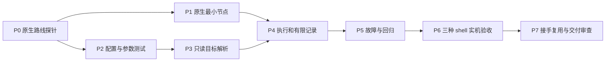

# 原生运行与测试 CLI 施工计划

## 交付边界

实现七个 run 入口，让接手会话从 list 找到用法，经 plan 核对目标后直接运行。测试执行使用 UE 原生工具。
本轮只编写计划。文中的新增文件、测试函数和命令均为施工目标，尚未实现，不能把本计划的校验当作产品验收。

| 固定项 | 内容 |
| --- | --- |
| 施工目录 R | `F:\AiProject\UnrealDevFlow\.aes-workflow\worktrees\ue-test-run-cli` |
| 分支、基线 | `feature/ue-test-run-cli`；`2a516b50dfb8b3d58e5a7962b7c0705c84ba78ce`，UDF 0.5.0 |
| 引擎 E | `C:\Program Files\Epic Games\UE_5.5`，本轮只核源码与路径 |
| 主项目 M | `F:\ShanghaiP4\neon\UGA\DEV\UGA.uproject`，workspace=`neon-dev` |
| 真实地图 | `/Game/Maps/UGA_local/aes6_sh_sz_q1`；本轮确认对应 umap 存在 |
| 历史案例 | `neon-dev/earthmodeler-exit-crash` 的旧 Host 已不存在，不能照旧路径开工 |
| 新实机夹具 | 执行阶段创建 `neon-dev/udf-run-acceptance`，仅用于 UDF 验收；不改 AesWorld 业务源码 |
| 证据目录 | `R\target\run-evidence\<本次运行标识>`；每次新目录，最终记录引用具体路径 |

下面的相对路径都相对于 R，并明确标注新建文件。源码路径表和步骤编号共同确定写入范围。
不得改主检出、其他任务源码或项目 Junction；不得回滚 AesWorld 来重演旧崩溃。历史日志只作判据样本，新 Host 的运行是新观察。
不增 Rust/NuGet 第三方依赖；不做后台监督器、环境快照门禁、通用断言 DSL、默认主项目副本或运行时控制插件。

## 开工门槛与依赖



P0 是首个可执行步骤。原生工具无法加载或不能获得所需退出信息时，只修原生接入问题；不启动替代 Gauntlet 的实现。
P1 与 P2 可并行，各自只写其专属文件。主实施者独占 src/cli.rs、src/main.rs、src/output.rs、src/editor.rs、src/commands/mod.rs 以及 workflow 记录，按 P3、P4 顺序集成。
已有步骤的验收未通过，不进入依赖它的下一步。没有 UE 的 CI 可完成模拟测试；实机项目不可用时，P6/P7 保持 not_run，不能宣告产品完成。

## 文件与责任

| 所属步骤 | 路径 | 改动责任 |
| --- | --- | --- |
| P0/P6 | 新建 `scripts/test-run-live.ps1` | 验收脚本，收集命令与原生证据；不作为产品测试运行器 |
| P1 | 新建 `resources/gauntlet/Udf.Automation.csproj`、`EditorExit.cs`、`StrictExitRules.cs`、`EditorExitRulesTests.cs` | 一个原生测试程序集及纯规则测试，直接使用引擎预编译引用 |
| P2 | 新建 `src/run_profile.rs`，含模块内 tests | 配置纯逻辑、保存、版本、来源、受控参数校验 |
| P2 | `src/main.rs` | 主实施者仅先加 mod run_profile 声明，使 P2 单元测试确实参与编译 |
| P3/P4 | 新建 `tests/run_profile.rs` | CLI 跨进程配置复用；P3验 list/plan，P4补 start |
| P2/P3 | 新建 `tests/run_commands.rs`、`tests/support/run_fixture.rs` | CLI、目标解析和只读副作用测试；临时 config/workspace/Host |
| P2/P6 | 新建 `tests/fixtures/run/editor-automation.json`、`tests/fixtures/run/editor-boot.json` | Automation 精确测试名及原生 EditorBootTest 配置 |
| P3 | `src/cli.rs`、`src/main.rs`、`src/commands/mod.rs`；新建 `src/commands/run.rs` | 注册命令，复用现有解析与 CheckState，构造同一份原生调用计划 |
| P3 | `src/editor.rs`；新建 `tests/run_existing_editor.rs` | 只读 PID/项目匹配，不改 switch 的已有行为 |
| P4/P5 | `src/commands/run.rs`、`src/output.rs`、`src/main.rs`；新建 `tests/run_lifecycle.rs`、`tests/support/fake_native.rs` | 等待原生入口，保存有限结果；保留失败数据且只输出一个 JSON |
| P5 | `tests/cli_taxonomy.rs`、`tests/query_semantics.rs` | 把 run 纳入通用约定，旧命令继续通过 |
| P5/P6 | 新建 `tests/skills/aes-workflow/test_run_acceptance.py` | AC-013 至 AC-025 的 case 包装，核对真实执行数量和证据 |
| P7 | `README.md`、`AGENTS.md`、`CLAUDE.md`、`skills/unrealdevflow/SKILL.md`、`skill/SKILL.md` | 更新帮助与实际命令示例；不刷新用户全局 skill |

复用点已核查：`host::resolve_task`、`host::resolve_host_uproject`、`Config::resolve_workspace`、`SourceContext`、`execution::CheckState`。
参考 `package_profile::resolve_binding` 和配置保存测试模式，但不能照搬其 workspace 的 host=project 语义；workspace + project=host 必须拒绝。
不扩展 package 的恢复状态机；run 的记录和结果类型留在自己的模块。现有 output::emit_failure 会丢 data，main 的 Err 分支还会再输出错误，P4 必须同时修调用边界。

## P0：证明原生路线可用

输入是 E、M、原生源码及历史日志。本步骤只创建验收夹具和写实机记录；不用 UDF run 的待实现功能证明自身前提。

```powershell
# 工作目录 R；执行阶段才运行这些命令。
git status --short
git rev-parse HEAD
udf workspace doctor neon-dev --format json
udf task list --format json
udf task create "UDF 原生运行与测试验收夹具" --workspace neon-dev --id udf-run-acceptance --type chore --primary AesWorld --yes
udf build check neon-dev/udf-run-acceptance --format json
# 只有 check=ready 才执行；deferred 等待锁释放，禁止 no-mutex 绕过。
udf build task neon-dev/udf-run-acceptance
```

脚本从 task create 的真实输出及 `.udf-meta.json` 取得 H，再由唯一 `.uproject` 得到 HostProject；不拼接猜测文件名。
已有同名验收任务时核对 workspace、主插件、创建用途和源码版本；不匹配就停止，不覆盖。依赖来源冲突只列明确候选，不猜 override-dep。

```powershell
$runUat = 'C:\Program Files\Epic Games\UE_5.5\Engine\Build\BatchFiles\RunUAT.bat'
# $HostProject 来自上段解析结果。
& $runUat RunUnreal "-project=$HostProject" -build=editor -test=UE.EditorBootTest -platform=Win64 -configuration=Development -NullRHI -Unattended -MaxDuration=120 "-TempDir=$ProbeTemp" "-LogDir=$ProbeLogs"
```

然后在同一新 Host 运行原始 Cmd 形态 `stat unit, QUIT_EDITOR`，与原生 BootTest 比较实际外壳、参数和退出路径。
脚本必须给每次调用独立日志位置、记录真实返回码；不会以命令回显证明两个外壳等价。

```powershell
& 'C:\Program Files\Epic Games\UE_5.5\Engine\Binaries\Win64\UnrealEditor-Cmd.exe' $HostProject '-ExecCmds=stat unit, QUIT_EDITOR' -unattended -nopause -nosplash -nullrhi "-abslog=$CmdLog"
```

ProbeTemp、ProbeLogs、CmdLog 均由脚本在新的 EvidenceRoot 下创建，先保存解析值再运行；所有 UAT probe 都显式传自己的 TempDir/LogDir，不能使用共享默认临时目录。
直接 Cmd 探针由脚本持有进程句柄，最多等 120 秒；超时核对本次 PID/创建时间/项目后结束该实例并记录 timeout，不以强杀得到的返回码证明正常退出。UAT 的测试超时交给原生 MaxDuration，不新写通用子进程树监督器。

通过条件：BootTest 确实被找到，Editor 确实启动，原生报告与进程身份可关联，原始码取得路径明确，退出日志完整。构建成功或 UAT 启动成功单独不算通过。
输出 `research/native-probe-research.md`，包含命令、H、版本、耗时、报告路径以及 Cmd/Editor 差异。失败时保留失败日志，停止 P1/P4；不改主项目或重建历史环境。

## P1：严格退出规则和原生程序集

先编写 `EditorExitRulesTests.cs` 中的表驱动测试，再实现 `StrictExitRules.cs` 与 `EditorExit.cs`。测试预期见下文判定表。
节点读取 `AppInstance.HasExited/WasKilled/ExitCode`，复用 Gauntlet Fatal/Ensure 判断和制品归档；同步命令后执行 QUIT_EDITOR，不负责任意异步业务编排。

csproj 使用 net8.0、Library、Development 和引擎预编译 DLL 的 Reference。源码不引用引擎 csproj，不要求改引擎或安装 NuGet 测试框架。
引用基于 UAT 注入的 `$(EngineDir)`：`Binaries/DotNET/AutomationTool/AutomationScripts/Gauntlet/Gauntlet.Automation.dll`、`AutomationUtils/AutomationUtils.Automation.dll` 和 `UnrealBuildTool.dll`，后两条同以 AutomationTool 目录为根。缺引用时只补本机现成 Epic 程序集引用，并在 probe 记录清单。
规则自测继承 Gauntlet.SelfTest.BaseTestNode，公共构造器接受 string[]；运行节点构造器接受 UnrealTestContext。EditorExit 直接继承 UnrealTestNode，不继承已提前添加 QUIT_EDITOR 的 EditorBootTest。在 ApplyToConfig 的 base 之后追加唯一退出命令，在 CreateReport 导出原始结果。
P1 用验收脚本将四份源码放到本次 ProbeRoot/gauntlet，供 UAT 原生 -ScriptDir 编译加载；此时不要求尚未实现的 UDF CLI。
P4 再把这四份小源码嵌入 udf.exe，start 展开到 `Config::config_dir()/gauntlet/<engine>/<resource-version>/<executionId>/`。每次执行的外部编译目录独立，避免两个 UAT 争写 ScriptModules。
不保存引擎 DLL 哈希快照。check 只验证随附资源、引擎引用和编译入口，不能编译或展开缓存；start 才准备私有缓存并交给 UAT。

```powershell
# $GauntletCache 是本次资源缓存根；P0/P1记录其具体值。
& $runUat "-ScriptDir=$GauntletCache" TestGauntlet -Test=Udf.EditorExitRulesTests "-TempDir=$ProbeTemp" "-LogDir=$ProbeLogs"
& $runUat "-ScriptDir=$GauntletCache" RunUnreal "-project=$HostProject" -build=editor -test=Udf.EditorExit -platform=Win64 -configuration=Development -NullRHI -Unattended -MaxDuration=120 '-ExecCmds=stat unit' "-TempDir=$ProbeTemp" "-LogDir=$ProbeLogs"
```

首次不加 -NoCompile。必须检查 UAT 生成的 ScriptModules 记录和实际加载程序集，单独 dotnet build 成功不算加载通过。
通过条件：纯规则矩阵全部通过；节点被 UAT 找到；真实 UE 退出码与 UAT 退出码分别导出。单 exe 的资源定位与实跑在 P6 验收，不作为 P1 前提。
无法加载时只检查外部 Automation 项目与引擎兼容，不复制 Epic DLL 到发布包。失败保留用户缓存和日志，仅重生成该版本的测试资源，禁止删除整个配置目录。

## P2：先锁定配置和参数契约

先写 `src/run_profile.rs` 内的纯逻辑/持久化单元测试，再实现模块。使用 TempDir 和显式测试路径，绝不写用户实际配置。
主实施者在 P2 加入模块声明，先用测试列表确认 run_profile::tests 存在；不能把未编入二进制的 0 个测试当作 P2 通过。

| 输入场景 | 必须得到的结果 |
| --- | --- |
| 保存后重新打开文件 | 配置来源和 digest 相同；CLI 跨进程复用留到 P3/P4 |
| task 与 workspace 有同名配置 | 选择 task 整份配置，不合并遗漏字段 |
| 旧验证后修改参数 | revision 增加，lastValidation 不再代表当前配置通过 |
| 初次无验证历史 | 显示待验证，但不阻止首次合法执行 |
| 两个 backend、未知字段、空 RunTest | 拒绝错误结构；Automation 缺输入返回 needsUserInput |
| name 含 ../、绝对路径、Windows 保留名 | configure 拒绝，目录外零写入 |
| nativeArgs 重复 project/map/mode/RHI/退出控制参数 | 拒绝并指出冲突，不采用“最后一个生效” |
| UAT 批处理参数含 shell 操作符/变量展开 | 拒绝危险透传；合法 ExecCmds 分隔保留在专用字段 |

验证命令：`cargo test --locked --bin udf run_profile::tests`。预期至少执行本表全部场景且零失败；保存新增测试先失败、实现后通过的输出。P2 不依赖尚未接入的 CLI。
配置写入用同目录临时文件后替换，保留失败前原文件。所有程序性写入路径做归属校验；只操作本次配置和版本资源。

## P3：只读解析、原生命令预览和已有 Editor

先写 `tests/run_profile.rs`、`tests/run_commands.rs` 与 `tests/run_existing_editor.rs`，再接七个 CLI 叶子命令；P3 只要求 configure/list/check/plan 的真实行为，其余执行叶子在 P4 完成。
在 P3 验 configure 后新进程 list/plan 的复用，P4 再补同一配置跨进程 start 的验收，AC-013 在 P4 才能整体通过。
解析链固定为显式 scope → 整份配置 → task 冻结 context 或 workspace → main/host → 原生工具与参数。不得使用 last_used_workspace 代替缺少的明确选择。
plan 的 nativeArgv 不含 executable，第一个元素是第一个参数；displayCommand 只用于展示，执行不得再解析它。
map 的 /Game 路径由所选项目 Content 解析。短名同名时列候选；插件挂载无法静态证明时列出原生确认路线并停止，不能猜 MountPoint。

```powershell
cargo test --locked --test run_commands
cargo test --locked --test run_profile
cargo test --locked --test run_existing_editor
cargo test --locked --test query_semantics
cargo run --locked -- run --help
```

通过条件：用子进程调用计数、目录前后差异证明 list/check/plan 零启动和零持久写入；错误 scope、错误绑定和缺地图均在启动前拒绝；plan 无动态 readiness。
已有 Editor 的 plan 返回 PID/项目候选和 actions；当前地图未知填 null，多实例不选第一个。只读检测不能发送命令、切 Junction 或关闭任何进程。
输出逐案 JSON 与空副作用清单。失败只修本步解析，不修改 workspace 来迎合错误测试。

## P4：执行、结果和有限记录

先用 `tests/support/fake_native.rs` 构造可控子进程，再写 `tests/run_lifecycle.rs`，覆盖 stdout 噪音、迟到失败和中断。替身仅在临时假引擎目录中使用，不进入产品路径。
实现前台 start，复用 P3 解析并重新预检。在此步完成四份原生资源的 include_str! 嵌入及每次执行的缓存准备。程序控制 argv，UAT 批处理只通过固定原生入口调用；不执行用户给出的 shell 命令字符串。
每次执行分配独立结果路径，交给原生工具作为报告/日志输出位置。状态读取只采信该次路径及节点/项目身份，不扫描公共 Crash 目录或取最新 mtime。

| 必须保存 | 内容 |
| --- | --- |
| 身份 | executionId、配置名/revision/digest、scope、实际项目与引擎、地图/模式 |
| 调用 | nativeExecutable、nativeArgv、开始/结束时间、原生入口返回码 |
| 结果 | state、testResult、exitResult、businessResult、可用的原始 ueExitCode |
| 证据 | 原生日志、报告、解析依据、明确的缺失项 |

记录写入 `Config::config_dir()/executions/run/<id>.json`，仅 start 更新该 scope 的最近执行引用。运行中可写 running，终态原子替换；不引入租约、心跳或事件恢复。
UDF 被中断且无最终结果时 status=unknown；即使已有成功报告，也必须满足该节点声明的终止条件，不能借 status 升级为通过。
普通 Editor/Game 启动返回 started；记录 PID 与日志位置，不承诺稍后获得其退出码。Commandlet 按原生结束码和报告判执行结果，业务结果未定义为 null。
实现保留 data 的失败输出，并保证 main 不再次发出第二份 JSON。原生日志写文件或 stderr；查询成功与测试通过分开。

验证命令：`cargo test --locked --test run_lifecycle`。通过条件是下文结果表及对照表全部满足，且 JSON 可完整解析为单个对象。
遇到失败保留执行记录；不清理日志来获得通过，不把重跑写回原 executionId。

## P5：验收包装与旧命令回归

`tests/skills/aes-workflow/test_run_acceptance.py` 为每条 Verify case 提供对应同名 unittest，调用下表 Rust 用例组或校验实机证据。
包装器必须检查实际匹配测试数大于 0；Cargo 返回 0 但过滤到 0 个测试不能通过。实机证据缺失必须报缺项，禁止 unittest.skip 后整体宣告验收通过。

```powershell
cargo test --locked --test run_profile --test run_commands --test run_existing_editor --test run_lifecycle
cargo test --locked --test cli_taxonomy --test query_semantics --test execution_contract --test package_profile --test package_lifecycle
cargo fmt --all -- --check
cargo clippy --workspace --all-targets --all-features --locked -- -D warnings
cargo test --workspace --all-targets --all-features --locked
cargo build --release --locked
```

通过条件：新测试无失败，原有测试不删减来规避回归，fmt/clippy/build 全为 0。输出逐条命令、返回码和测试计数；无 UE 的 CI 不出具 AC-022/023 的通过结论。
失败时只撤回本步骤引入的行为改动，保留红测与证据；不得 reset/checkout 覆盖其他会话改动。

## P6：真实 Host 与三种 shell

本步补全脚本 `scripts/test-run-live.ps1`，实机参数固定为 `-Suite Host|Shells|All -UdfPath -Workspace -Task -EvidenceRoot`。
脚本解析实际项目/引擎，先预检，再运行已保存配置；只管理自己启动且身份已核对的测试实例。每次输入一个新的 EvidenceRoot，拒绝复用已有目录。
以下命令是该脚本实现后的入口，不是现有功能。

```powershell
pwsh -NoProfile -File scripts/test-run-live.ps1 -Suite All -UdfPath .\target\release\udf.exe -Workspace neon-dev -Task neon-dev/udf-run-acceptance -EvidenceRoot .\target\run-evidence\live-01
```

先登记配置再执行测试。脚本把已核对的 neon-dev 路径登记到 EvidenceRoot/config，用 `UNREALDEVFLOW_CONFIG_DIR` 限定本次运行，不覆盖用户配置或已存在的同名用法。task 配置只写本计划创建的专用 Host。
脚本中的配置调用固定为：

```powershell
& $UdfPath run configure editor-exit --task neon-dev/udf-run-acceptance --file .\workflow\ue-test-run-cli\assets\editor-exit-native-v3.json
& $UdfPath run configure editor-boot --task neon-dev/udf-run-acceptance --file .\tests\fixtures\run\editor-boot.json
& $UdfPath run configure perflab-game --workspace neon-dev --file .\workflow\ue-test-run-cli\assets\perflab-game-native-v3.json
& $UdfPath run configure automation-smoke --task neon-dev/udf-run-acceptance --file .\tests\fixtures\run\editor-automation.json
```

以上相对候选文件由脚本按 R 解析为绝对路径；传给 udf 的 scope 由传入的 Workspace/Task 校验一致后使用。同名配置内容不同时拒绝覆盖。Suite 分开跑时也执行对应配置准备，不能依赖 All 的隐含先序。

Host 套件运行原生 EditorBootTest、Udf.EditorExit 和 UE.EditorAutomation。Automation 首选精确用例 `Earth.Elevation.SpatialElementConstruction`，本轮在 AesWorld 的 `Source/EarthModeler/Private/Elevation/EarthElevationTests.cpp:150` 核实它只构造局部对象并检查完成。
执行前核对新 Host 中仍有此用例；不存在时本项停止并更新计划中的用例选择，不自动换成全量测试。报告必须给出精确匹配名，不能硬用 Group:AI 当所有项目都有。
原生参数固定为 `-test=UE.EditorAutomation -RunTest=Earth.Elevation.SpatialElementConstruction`，`-ReportExportPath` 指向本次结果目录。UDF 将报告路径作为受控参数，nativeArgs 不得改写。
至少一次 Automation 实际执行数大于 0且全部通过；再用不存在的过滤条件证明零匹配不通过。不得制造共享项目崩溃来验非零码，故障矩阵由 P1/P4 可控夹具承担。

Shells 套件在 `neon-dev` 的主项目使用固定地图和 1366×1024 windowed/default RHI 配置，依次从三个进程入口执行：

```text
PowerShell: udf run start perflab-game --workspace neon-dev --format json
cmd:        udf run start perflab-game --workspace neon-dev --format json
Git Bash:   udf run start perflab-game --workspace neon-dev --format json
```

三种 shell 都调用同一个绝对 UdfPath。Git Bash 不靠 MSYS_NO_PATHCONV 临时修补；调用方只传配置名，地图从配置读取。
脚本通过 PowerShell -NoProfile、cmd /d /s /c 和已解析的 Git Bash --noprofile --norc -c 分别发起调用，记录实际 shell 路径；缺少其中一种就将对应项记 not_run，不降成参数字符串测试。
每次必须保存引擎实际 Browse 目标、窗口/分辨率依据和自身 PID；读取不到实际状态就不通过该项。完整项目测试开始前确认主项目绑定，若被别的 task 占用则停止此实机项，不切换或关闭别人的 Editor。
每轮取证后，脚本核对自己记录的 PID、创建时间、可执行文件和项目命令行，只对该实例发 CloseMainWindow 并等待 15 秒。仍未退出时只结束该已核实实例并等待确认，身份不符则停止脚本。确认退出后才启动下一种 shell。
这项测试结束后的清理不作为自然退出通过证据。脚本把强制清理记录在 evidence 中，不新增 UDF stop 协议；不得按进程名批量终止。
不要求性能提升、不做像素级对照；本项验的是正确场景与启动组合。

Host 套件还须把 release/udf.exe 单独复制到 EvidenceRoot/install，切换到不含 R 资源的 cwd，以空原生缓存执行 editor-exit。确认源码来自二进制内嵌资源，UAT 编译加载并取得正常结果；不复制 resources 目录、不设置指向 R 的兜底变量。

## 判定表：必须写成测试，不能只留说明

### 严格退出节点

原生致命失败和已知强杀优先判 failed。没有这些已知失败，但必要退出事实缺失时判 unknown。

| 场景 | 原始 UE 码 | 预期 exitResult |
| --- | --- | --- |
| 自然结束、无 Fatal、无强杀 | 0 | passed |
| 自然结束、只有普通 Error 日志 | 0 | passed |
| 自然结束、未解析到 Fatal | 3 | failed |
| 报告归一化成功，但原始码非零 | 3 | failed |
| 有 Fatal，即使报告成功 | 0 或 null | failed |
| WasKilled=true，即使原始码为 0 | 0 或 null | failed |
| 超时并由 Gauntlet 终止 | 任意 | failed |
| 自然结束但原始码拿不到 | null | unknown |
| 只出现 QUIT_EDITOR 文本、未确认结束 | null | unknown |
| 业务通过，之后退出崩溃 | 3 | failed；businessResult 可为 passed，总体 failed |

Ensure 沿用所选原生测试的明确策略，开关值进入记录；不把普通 Error、Ensure 和 Fatal 混为一类。测试覆盖 FailOnEnsures 两个取值。

### CLI 返回

| 命令/结果 | ok | 进程码 | 关键字段 |
| --- | --- | --- | --- |
| start：已启动交互程序 | true | 0 | state=started，testResult=null |
| start：原生测试通过且结束条件齐全 | true | 0 | state=passed，原生依据存在 |
| start：明确失败 | false | 1 | state=failed，executionId/报告仍在 data |
| start：执行结果未知 | false | 1 | state=unknown，缺失原始码为 null |
| start：预检不通过 | false | 1 | readiness/reasons；无 executionId、无新记录 |
| check：成功得出任意四态 | true | 0 | readiness 与 reason code，未启动 |
| status：成功读取失败或 unknown 记录 | true | 0 | 如实显示该次 state |
| 无效语法/互斥 scope | 沿用 clap | 2 | 语法错误，不启动 |
| compare：普通查看 | true | 0 | differences；expectationMet=null |
| compare：期望满足/不满足 | true/false | 0/1 | expectationMet=true/false |

业务错误如未知配置或查不到 executionId 返回 1；查询规则“成功返回 0”不吞掉查询失败。
待观察的测试为 running，不能当成测试终态；只有交互启动才能把 started 作为正常返回。

### 前后对照

| 两份记录 | 默认 compare | --expect pass-after-fail |
| --- | --- | --- |
| 同配置/逻辑目标/已知引擎/地图模式，失败→通过，代码版本不同 | 展示差异 | 通过 |
| 缺 DLL 哈希和布局快照，其余满足 | 正常展示 | 通过 |
| 任一端 unknown/started、零测试、仅启动失败 | 正常展示 | 不通过 |
| 配置内容、逻辑目标、引擎或显式地图模式不同 | 显示具体差异 | 不通过 |
| 关键比较字段缺失 | 标 unknown 差异 | 不通过 |
| 两边都通过、两边都失败或通过→失败 | 正常展示 | 不通过 |

before 必须是原生测试已实际执行后的明确失败。历史两份裸日志不冒充两条新 execution 记录，不新增导入功能；原故障签名只用于检查测试判据，不升级为修复因果证明。

## 产品验收矩阵

| AC | 主验收位置/方法 | 必须保留的证据 |
| --- | --- | --- |
| 013 | run_profile：两进程、继承、修改后待验证、首次执行 | 配置前后内容及两个进程 JSON |
| 014 | run_commands：明确目标/错误目标/歧义/绑定漂移 | 解析路径与零启动计数 |
| 015 | run_commands/query_semantics：四态、无副作用、start 重检 | 调用计数与目录差异 |
| 016 | run_profile/run_commands：参数、路径、批处理边界；023补真机 | nativeArgv 与拒绝原因 |
| 017 | run_lifecycle：逐行 CLI 表、输出噪音、迟到失败 | 单 JSON、返回码、制品引用 |
| 018 | EditorExitRulesTests 与 run_lifecycle：逐行退出表 | 实际执行行数及原始/归一化码区别 |
| 019 | run_lifecycle：Automation/Commandlet/异步入口；022补真机 | 测试数、完成状态、过滤条件 |
| 020 | run_lifecycle：缺记录/损坏/串报告/中断与逐行比较表 | 独立 executionId 和比较输出 |
| 021 | run_existing_editor：0/1/多个实例、未知地图 | PID候选、人工 actions、零操作计数 |
| 022 | P0/P1/P6 的 Host 原生实跑及单 exe 临时目录 | 本次引擎/Host/工具身份、日志、报告、原始退出码 |
| 023 | P6 的三个 shell 顺序实跑 | 三份实际 Browse/分辨率证据及调用命令 |
| 024 | P7 的独立接手复用 | 两个 executionId、接手步骤、未改配置声明 |
| 025 | P5 全量质量检查、P7 范围和帮助审查 | 命令退出码、差异清单、帮助与文档对应表 |

Verify case 包装位于 `tests/skills/aes-workflow/test_run_acceptance.py`。013..021 调用对应 Rust/C# 测试，022/023 校验 P6 的显式 EvidenceRoot，025运行质量门禁并核对范围审查。
证据至少包含本次 UDF 版本/源码 revision 和每条命令实际执行时间。旧日志、其他机器结果、空报告都不能替代当前实跑。节点实跑还须确认 stat unit 先于唯一 QUIT_EDITOR；看到业务命令完成不能提前结束节点并让 Gauntlet Kill Editor。
最终 validation.md 按 AC 编号记录 passed/failed/not_run、方法及具体路径。不能只写“所有测试通过”，不能把 skip 折算为 passed。

## P7：接手复用、文档与收口条件

1. 使用 P6 已登记且实测的两份配置；不在接手阶段再调整参数。候选有修改时先回 P6 重验。
2. 给未读旧会话的接手者提供 udf 的位置、验收配置目录、明确 scope 与两个用途，不能提供完整命令。允许使用 --help、run list 和 plan。接手进程继承相同 UNREALDEVFLOW_CONFIG_DIR，不读父会话历史。
3. 接手者分别完成严格退出与指定地图启动；每个案例允许 1 次预览和 1 次 start，不需修改配置或搜索旧会话。已有 Editor 正在占用时走明确提示，不计为命令猜错，先记录环境阻塞。
4. 更新源 skill 与入口文档，并核对每条新示例能由实际 help 接受。已有 Editor 的人工路线明确写出“不自动执行”。
5. 独立代码审查与逐项验收之后才写 delivery；本计划 ready 或单元测试通过都不表示产品已交付。

产品完成要求 AC-001..025 均有相应阶段证据；AC-022/023 必须有实机证据，AC-024 必须有独立接手者的执行记录。接手者可以是人，也可以是未继承旧会话的独立代理；最终人工确认仍按仓库收口流程。任何 failed/not_run 均不能标任务 done。
当前 UE 版本之外只声明未验证，不承诺跨版本全支持。没有发布请求时不改版本、不打 tag、不发布；以后发布仍走既有 release-preflight 和 draft/installer 验证。
源码资源嵌入单 exe，所以首版不改发布资产集合，不把克隆仓库或安装 Rust 变成使用前提。

## 回退和保留

| 失败处 | 恢复动作 |
| --- | --- |
| 原生路线不可用 | 留 probe 日志，停止依赖步骤；修兼容适配后重跑 P0 |
| 配置写入失败 | 保留原配置，删除的只能是已核对归属的本次临时文件 |
| 执行/中断失败 | 保留原 execution 与制品；重跑产生新 ID |
| Rust/文档回归 | 只改回本任务引入的对应行为，保留回归测试；不批量撤销其他修改 |
| 主项目被其他会话使用 | 本项 not_run，不关闭别人的 Editor，不切 Junction |
| 验收完成后的测试 Host | 保留，清理仍需明确授权并使用 udf task cleanup/delete |

施工先写测试再实现，每步保留红测、通过结果和修改说明。现有 package/workspace/task 行为变化属于回归，不借本任务整理无关代码。
