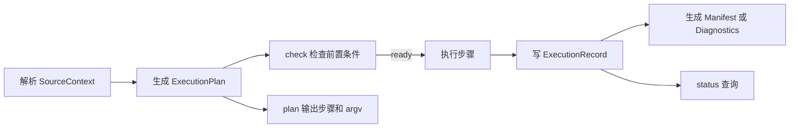

# UnrealDevFlow 原生发布编译命令设计

## 要解决什么

UnrealDevFlow 目前只提供开发期 Editor 编译。它需要原生覆盖 UEB 已验证的项目包、插件包、源码引擎编译、Installed Build、执行计划、制品清单和失败诊断，同时维持按一级类别和二级命令组织的交互方式。

## 目标

用户从 task 或 workspace 选择源码后，使用同一套 `build` 和 `package` 命令获得一致的执行计划、状态、日志、JSON 结果和制品证据。

## 非目标

- 不调用 UEB 运行时，也不复制它的 TypeScript 结构。
- 不负责源码拉取、版本写入、签名、上传、通知或生产发布。
- 不新增顶层 `pipeline`、`diagnostics`、`inspect`、`explain`、`clean` 或 `switch`。
- 不改变现有 `task switch` 的含义。

## 方案对比

| 方案 | 怎么做 | 代价 | 结论 |
| --- | --- | --- | --- |
| 按 UEB 命令平铺 | 新增多个顶层命令，直接映射 UEB 的 build、package、inspect、explain、pipeline 和 clean | 用户需要理解两套分类规则；同类动作散落；与 UDF 现有四个一级类冲突 | 不选 |
| 按执行技术分类 | 顶层设置 UBT、UAT、BuildGraph，再把具体动作放到下面 | 暴露 UE 内部工具；用户要先知道实现方式；同一制品会跨多个类 | 不选 |
| 按用户目的和制品对象分类 | `build` 负责编译结果，`package` 负责可传递制品；二级命令按 project、plugin、engine 和统一动作词典组织 | 需要抽出共用来源解析、计划和执行记录模型 | 选定 |

## 一级命令

| 一级类 | 固定含义 | 本次变化 |
| --- | --- | --- |
| `workspace` | 配置和检查 UE 项目环境 | 增加 `inspect`，扩展 `doctor` 的发布检查 |
| `task` | 管理隔离开发任务 | 不增加发布专用二级命令 |
| `build` | 生成用于开发和验证的编译结果 | 增加 `engine` 和统一 `plan`；保留 task、project、check、status、gate |
| `package` | 生成可保存、传递或发布的制品 | 新增一级类 |
| `skill` | 管理 AI skill | 不变 |

## 命令树

```text
udf
├─ workspace
│  ├─ init
│  ├─ add
│  ├─ list
│  ├─ status
│  ├─ doctor
│  └─ inspect
├─ task
│  └─ 现有命令
├─ build
│  ├─ task
│  ├─ project
│  ├─ engine
│  ├─ check
│  ├─ plan
│  ├─ status
│  └─ gate
├─ package
│  ├─ project
│  ├─ plugin
│  ├─ engine
│  ├─ check
│  ├─ plan
│  ├─ run
│  ├─ status
│  └─ clean
└─ skill
```

## 统一二级命令契约

同名二级命令必须由共享定义生成帮助、状态和 JSON 字段。每个一级类只能增加适用的命令，不能改写词义。

| 二级命令 | 固定解释 | 参数与结果契约 |
| --- | --- | --- |
| `project` | 对解析出的 UE 项目执行一级类的主动作 | 共用来源选择、platform、configuration 和 project 字段 |
| `plugin` | 对解析出的插件集合执行一级类的主动作 | 共用插件选择、依赖闭包和 seed 顺序规则 |
| `engine` | 对解析出的 UE 引擎执行一级类的主动作 | `build engine` 编译源码引擎；`package engine` 生成 Installed Build |
| `check` | 判断指定动作现在是否可执行 | 不启动 UE；状态固定为 ready、needsUserInput、blocked、deferred |
| `plan` | 展示实际会执行的阶段、argv 和输出位置 | 无构建副作用；输出统一的 resolved、steps、outputs、diagnostics 字段 |
| `run` | 执行配置中声明的多个阶段 | 按顺序执行，首个失败停止，保留已完成阶段证据 |
| `status` | 查看一次执行的当前状态和证据 | 共用 executionId、state、currentStep、timestamps、exitCode、logs、artifacts 字段 |
| `clean` | 清理由该一级类创建并记账的可再生文件 | 先生成精确清理计划，只允许删除记录内目标 |

`list`、`show`、`create`、`delete` 等词也应进入同一词典。它们不因本次功能新增，但后续新增命令必须遵守同一规则。

## 来源选择

所有 build 和 package 主动作使用同一个来源解析器。来源只决定路径、版本和可选默认对象，不改变执行行为。

```text
显式 task ref ─┐
               ├─ SourceContext ─> 同一个计划生成器 ─> 同一个执行器
显式 workspace ┘
```

`SourceContext` 至少包含 workspace、project、engine、plugins root、Host、primary plugins、dependency plugins 和 source revision。命令不给来源时，只在唯一候选存在时自动选择；存在多个候选时返回 `needsUserInput`。

同一个插件从 task 或 workspace 输入时，依赖闭包、UBT 矩阵、包目录、manifest 和结果字段完全相同。只有源码绝对路径和 revision 不同。

## Build 与 Package 的边界

| 命令 | 目的 | UE 后端 | 主要结果 |
| --- | --- | --- | --- |
| `build task` | 验证任务 Host 的 Editor 编译 | Build.bat | DLL、日志和编译状态 |
| `build project` | 验证 workspace 主项目 Editor 编译 | Build.bat | DLL、日志和编译状态 |
| `build engine` | 编译源码引擎 | GitDependencies、GenerateProjectFiles、Build.bat | 引擎编译结果 |
| `package project` | 生成可运行项目包 | RunUAT BuildCookRun | Cook、Stage、Archive、Package 制品 |
| `package plugin` | 生成可分发插件包 | 依赖感知直接 UBT；兼容模式可用 BuildPlugins | 每个 seed 的独立插件包 |
| `package engine` | 生成 Installed Build | RunUAT BuildGraph | 可分发引擎目录 |

`profile` 与 `configuration` 保持独立。`profile` 控制 UDF 加严检查，`configuration` 使用 Unreal 的 Development、Shipping、Debug 或 Test。

## 计划与执行

所有主动作先生成不可变 `ExecutionPlan`，实际执行只消费计划。`check` 评估计划能否开始，`plan` 输出计划，主动作或 `run` 执行计划，`status` 读取执行记录。



计划至少包含 action、source、steps、outputs、mutex policy、profile、configuration 和清理边界。每一步保存结构化 argv，禁止拼接 shell 字符串。

## 执行记录

现有 task build 状态只能描述单个进程。新模型需要覆盖单阶段和多阶段，并让 build 与 package 共用。

| 字段 | 含义 |
| --- | --- |
| `executionId` | 一次执行的稳定标识 |
| `domain` | build 或 package |
| `action` | task、project、plugin、engine 或 run |
| `source` | task 或 workspace 解析结果及 revision |
| `state` | planned、running、succeeded、failed、cancelled、unknown |
| `currentStep` | 当前阶段编号和名称 |
| `steps` | 每步 argv、状态、时间、退出码和日志 |
| `artifacts` | 制品目录和 manifest 路径 |
| `diagnostics` | 失败分类、摘要和诊断包路径 |

现有 `build status` 迁移到该记录模型，并保留不带 execution ID 时查询最近任务编译的兼容行为。

## 制品与诊断

成功执行生成 manifest，记录相对路径、字节数和可选 SHA-256。失败执行生成诊断包，包含结构化报告、人读摘要、每步 stdout、stderr 和 UE 日志索引。

诊断暂不成为一级对象。`build status` 或 `package status` 返回诊断位置，`package clean` 只能清理由 package 记录持有的 staging、制品和诊断目录。

## 门禁

门禁从“只认两条 build 命令”改为“只认 UDF 生成并登记的执行计划”。它允许计划中的 Build.bat、RunUAT、BuildGraph 和直接 UBT 步骤，继续拒绝用户直接执行原始 UE 命令。

Mutex 策略统一放入计划。默认值不能照搬 UEB 的 no-mutex。`check` 必须根据引擎共享中间产物和当前进程判断 ready 或 deferred。显式 no-mutex 只有在计划能证明输出和中间产物隔离时才允许。

## 配置

发布配置扩展 workspace，而不是新建一份平行配置。命令行覆盖 workspace 默认值。配置至少支持 archive root、plugin output root、stage root、installed build output、platform、configuration、hash manifest 和 pipeline steps。

`package run` 只执行 workspace 中声明的步骤。本次不提供具名 pipeline 的 list、show、create、delete，因此不新增顶层 `pipeline`。

## 顺利场景

用户运行 `udf package plugin AesWorld --task neon-dev/my-task --platform Win64+Linux`。工具解析任务冻结上下文，计算与 workspace 来源相同的依赖闭包和构建矩阵，检查 mutex，逐步编译并组装 AesWorld 包，最后返回 execution ID、两个平台制品、manifest 和日志。

## 出错场景

用户运行项目打包时另一个 UBT 占用共享中间产物。`package check` 返回 `deferred`，实际命令不启动。若 Cook 已经开始后失败，执行记录保留之前步骤，状态为 failed，结果给出失败阶段、退出码、诊断摘要和重新执行相同计划所需的参数。

## 中断后恢复

后台进程消失但没有退出码时，状态写为 unknown，不能推断成功。用户重新运行相同命令时，工具重新生成计划，核对来源 revision 和输出目录。能安全复用的插件 stage 与缓存继续使用，来源或关键配置变化时重建受影响部分。

## 影响面

预计会改动 CLI 定义、主分发、构建策略、workspace 配置、输出协议和命令模块，并新增 package、计划、执行记录、manifest、diagnostics 及相应测试。正式计划阶段使用以下命令复算影响面：

```powershell
rg -l "BuildAction|build status|build gate|OutputFormat|WorkspaceConfig" src tests
rg -l "package|RunUAT|BuildGraph|manifest|diagnostic" src tests docs
```

## 算做对

- UEB 的项目、插件、引擎和步骤编排都有原生入口或明确不引入的理由。
- task 与 workspace 对同一制品产生同形计划和结果，只允许来源字段不同。
- 同名二级命令由共享契约验证帮助、参数、状态和 JSON 字段。
- `plan` 没有构建副作用，实际执行 argv 与计划逐项一致。
- 门禁允许声明过的 UAT 和 UBT 步骤，仍拒绝原始绕过命令。
- 失败时能定位具体阶段并找到诊断证据。

## 未决问题

没有会改变目标、范围或用户行为的未决问题。输出目录的具体默认路径、执行记录文件名和模块拆分可以在计划与实现阶段决定。
