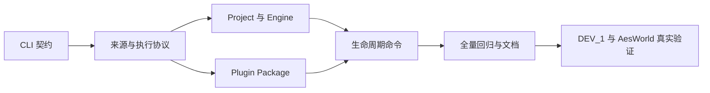

# 原生发布编译命令实施计划

## 基线与输入

- UnrealDevFlow 分支：`research/ueb-packaging-build-compatibility`
- 基线：`5138373f7a15d01c95a06022c153f73c8be7b3e6`
- 真实插件：`F:\ShanghaiP4\neon\Plugins\AesWorld`
- 真实主项目：`F:\ShanghaiP4\neon\UGA\DEV_1`
- UEB 只作为行为和测试对照，不修改其仓库。

## 步骤

| 步骤 | 测试先行 | 修改文件 | 行为结果 | 验证与证据 | 退回办法 |
| --- | --- | --- | --- | --- | --- |
| 1. 锁定 CLI 分类与统一词典 | 在 `tests/cli_taxonomy.rs` 添加 help 与解析测试 | `src/cli.rs`、`src/main.rs`、`src/commands/mod.rs` | 新增 `package`；新增 `build engine/plan`、`workspace inspect`；同名 check/plan/status 使用一致说明 | `cargo test --test cli_taxonomy`，帮助树包含设计声明的命令 | 删除新增枚举和分发分支 |
| 2. 建立来源、计划和执行协议 | 在 `tests/execution_contract.rs` 覆盖 task/workspace 同形计划、状态词和 JSON 字段 | 新增 `src/execution.rs`、`src/source_context.rs`，调整 `src/output.rs`、`src/config.rs` | build/package 共用 SourceContext、ExecutionPlan、ExecutionRecord | `cargo test --test execution_contract`；两种来源只在 path/revision 不同 | 保留旧 build status，移除新协议模块 |
| 3. 实现 project 和 engine 命令计划 | 在 `tests/package_commands.rs` 锁定 UEB 对齐 argv | 新增 `src/commands/package.rs`、`src/ue_commands.rs`，调整 build policy | `package project` 生成 BuildCookRun；`build engine` 生成 GitDependencies、GenerateProjectFiles、Build.bat；`package engine` 生成 BuildGraph | `cargo test --test package_commands`；逐参数对齐 UEB 源码与业务 golden | 移除命令入口，不执行真实命令 |
| 4. 实现插件发布包 | 在 `tests/plugin_package.rs` 覆盖 seed、闭包、Win64/Linux 矩阵、task/workspace 一致性 | 新增 `src/package/plugin.rs` 及 graph、stage、matrix、manifest 子模块 | `package plugin` 计算依赖闭包，建立隔离 staging，直接 UBT 编译并组装每个 seed 包 | `cargo test --test plugin_package`；计划与 UEB golden 同形 | 保留 staging，不动源插件；删除新增模块可退回 |
| 5. 实现 plan/check/run/status/clean | 在 `tests/package_lifecycle.rs` 覆盖无副作用计划、失败短路、unknown 状态和精确清理 | 扩展 `src/commands/package.rs`、`src/execution.rs`、`src/build_policy.rs` | 多阶段执行有 execution ID、步骤日志、manifest、diagnostics；clean 只删记账目标 | `cargo test --test package_lifecycle` | 不运行 clean；移除新记录读取路径 |
| 6. 兼容旧 build 并更新文档 | 扩展 CLI 与输出回归测试 | `README.md`、相关 skill 文档、旧 build status 适配 | 旧命令继续工作；帮助和中文说明统一 | `cargo test`、`cargo fmt --check`、`cargo clippy --workspace --all-targets --all-features --locked -- -D warnings` | 恢复旧分发并保留新模块隔离 |
| 7. 真实自动验证 | 添加可重复的真实环境 smoke 用例或脚本 | `tests/real_package_smoke.rs` 或 `scripts/` 下受控脚本 | 对 DEV_1 生成 project/package plan；对 AesWorld 生成 plugin plan，并在资源允许时执行真实插件包或项目包 | 先跑 plan 和 check，再按门禁执行；记录真实命令、输出目录、日志和退出码 | 所有输出放独立目录，失败后保留诊断，不修改源项目和插件 |

## 依赖顺序

## 风险

| 风险 | 控制方法 |
| --- | --- |
| 真实 package 耗时长或占用 UBT | 先运行 check；使用 UDF 门禁；保留 PID、日志和独立输出目录 |
| DEV_1 或 AesWorld 工作区有用户改动 | 只读源码，输出到项目外的独立 artifacts 目录，不清理未知文件 |
| 无源码引擎无法执行 engine build | 用 UEB 源码、UE5.5 参数知识和 argv golden 完整对齐；明确记录未真实执行 |
| 插件依赖复杂 | 先锁闭包与矩阵纯函数测试，再接文件 staging 和进程执行 |
| 命令面一次变化过大 | 每一步独立测试和提交代码，workflow 记录留到收口 |
