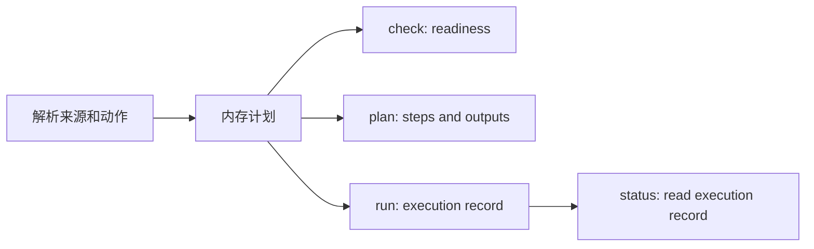

# 统一检查、计划和状态命令

## 要解决什么

当前 Build 和 Package 都提供 `check`、`plan`、`status`，实现没有守住三个时间点。`build check` 与 `build plan` 返回相同的 `BuildCheckOutput`；Package 的 `check` 和 `plan` 都保存 execution 记录并覆盖 `latest`。实测先运行 `package check plugin`，再运行 `package status`，状态返回 `ready` 和完整命令，却没有任何打包执行发生。

## 查到的事实

| 分类 | 查询命令 | 当前行为 | 问题 |
| --- | --- | --- | --- |
| Build | `check` | 解析来源、命令、Mutex 和 readiness | 同时承担计划展示 |
| Build | `plan` | 调用与 `check` 相同的解析函数和输出结构 | 与 `check` 只差命令名 |
| Build | `status` | 从任务元数据读取后台 Task Build | 不覆盖 Project 和 Engine，也不按 execution ID 查询 |
| Package | `check` | 验证工具文件和部分 Mutex，同时输出完整命令 | 输出与 `plan` 大部分重复 |
| Package | `plan` | 输出完整命令和路径 | 生成 execution ID，保存记录并覆盖 `latest` |
| Package | `status` | 读取 `latest` 或指定 execution ID | `latest` 可能指向 check 或 plan |
| Workspace | `inspect` | 展示解析后的项目、Engine 和插件来源 | 词义清楚 |
| Workspace | `doctor` | 检查登记内容和文件健康状况 | 词义清楚，范围比 inspect 深 |
| Workspace | `status` | 展示项目当前切到哪个任务 | 表示既有对象的当前状态，没有执行记录含义 |
| Task | `list`、`next` | 展示任务清单或建议下一步 | 不属于执行查询 |
| Skill | `list` | 展示安装位置 | 不属于执行查询 |

## 统一词义

| 命令 | 固定问题 | 时间点 | 是否写记录 | 核心输出 |
| --- | --- | --- | --- | --- |
| `inspect` | “解析出来的对象是什么？” | 当前配置 | 否 | 来源、路径、身份 |
| `doctor` | “这个环境哪里坏了？” | 当前环境 | 否 | 检查项、问题、修复建议 |
| `check` | “这个动作现在能启动吗？” | 执行前 | 否 | readiness、检查项、原因、建议动作 |
| `plan` | “启动后会执行什么？” | 执行前 | 否 | 步骤、argv、输出位置、计划摘要 |
| `status` | “已有对象或执行现在是什么状态？” | 创建或启动后 | 否，只读既有记录 | 状态、时间、退出码、日志、制品、诊断 |
| `list` | “现在有哪些对象？” | 当前库存 | 否 | 对象清单 |
| `next` | “按工作流下一步做什么？” | 当前任务状态 | 否 | 建议动作 |
| `gate` | “这条外部命令允许通过吗？” | 外部命令启动前 | 否 | allowed、拒绝原因；拒绝时退出码非零 |

同名命令共享解释，不要求每个一级分类机械地拥有全部命令。Build 和 Package 是可执行领域，需要 `check`、`plan`、`status`。Workspace 没有长时间执行记录，保留 `inspect`、`doctor`、`status`。Task 和 Skill 继续使用符合对象含义的 `list` 与 `next`。

## 方案对比

| 方案 | 做法 | 代价 | 判断 |
| --- | --- | --- | --- |
| A. 保留三个命令并严格分工 | `check` 只给 readiness，`plan` 只给执行步骤，`status` 只读真实执行 | 需要重构执行记录和 Build 状态 | 推荐。用户问题不同，自动化也需要轻量 readiness |
| B. 删除 `check` | `plan` 同时带 readiness，自动化解析其中一部分 | `plan` 继续混合动态环境和静态步骤，输出较重 | 可用，但无法让门禁只读取稳定的小结果 |
| C. 维持现状 | 只改帮助文字 | `status` 继续被 check/plan 污染，Build 两条命令继续相同 | 不接受，已经有可复现的错误状态 |

## 选定方案

采用方案 A。

Build 和 Package 先生成同一份内存计划。三个命令从这份计划读取不同部分：



`check` 和 `plan` 不生成 execution ID，不保存文件，也不修改 `latest`。真正启动 Task、Project、Engine 或 Package 后才生成 execution ID。`status` 的默认 `latest` 只指向同一领域最近一次真实执行。

## 输出契约

### check

Build 与 Package 共用：

```text
domain, action, source, readiness, checks[], diagnostics[], nextCommand
```

`readiness` 固定为 `ready | needsUserInput | blocked | deferred`。命令成功回答问题时退出码为 0，即使 readiness 是 blocked。解析失败等无法回答的情况返回非零。

### plan

Build 与 Package 共用：

```text
domain, action, source, planDigest, steps[], outputs[], diagnostics[]
```

`steps[]` 包含阶段名、executable 和 argv。`planDigest` 根据规范化步骤生成，可用于比较计划是否改变。它不充当 execution ID。

### status

Build 与 Package 共用：

```text
executionId, domain, action, source, state, currentStep,
startedAt, finishedAt, exitCode, steps[], logs[], artifacts[], diagnostics[]
```

`state` 固定为 `running | succeeded | failed | cancelled | unknown`。`planned` 不进入 status，因为计划没有启动执行。

## 兼容策略

- 保留 `build check`、`build plan`、`build status` 和 Package 的同名命令，脚本入口不删除。
- `build status <task-ref>` 暂时兼容旧任务引用，同时新增 execution ID 查询。旧入口在 human 输出提示迁移，在 JSON 中标明查询来源。
- Package 以前保存的 `planned` 和 `ready` 记录仍可按显式 execution ID 读取，但不再参与 `latest`。
- `package run` 当前等价于项目发布入口。后续若没有配置驱动的多阶段定义，应单独评估删除；本任务不顺手改变它。

## 顺利、失败和中断

| 场景 | 预期行为 |
| --- | --- |
| 工具和 Mutex 都可用 | `check` 返回 ready；`plan` 展示步骤；执行命令生成 ID；`status` 返回 running 或 succeeded |
| Mutex 正忙 | `check` 返回 deferred；`plan` 仍展示未来步骤；`status` 不受影响 |
| UBT DLL 缺失 | `check` 返回 blocked 并点名路径；`plan` 仍可展示命令并附诊断；不会覆盖 latest |
| 执行中断 | 已生成的 execution 记录转为 failed、cancelled 或 unknown；`status` 返回日志和当前步骤 |
| 从未执行过 | `status` 明确返回没有执行记录；不能拿最近一次 check 或 plan 代替 |

## 影响面

当前 6 个执行查询入口分布在 Build 和 Package 中，另有 Workspace 的 `inspect`、`doctor`、`status`。预计修改 CLI 路由、共享执行模型、Build 策略输出、Build 状态、Package 执行和对应集成测试，至少涉及 6 个源码文件与 4 个测试文件。复算命令：

```powershell
rg -n "Action::(Check|Plan|Status)|\\b(Check|Plan|Status) \\{" src
rg -n "build (check|plan|status)|package (check|plan|status)" tests README.md
```

## 怎么算做对

- 连续执行 `package run`、`package check`、`package plan` 后，`package status` 仍指向 `package run` 的 execution ID。
- Build 与 Package 的 check、plan、status 分别共享一套字段和帮助解释。
- `build check` 与 `build plan` 的 JSON 结构明确不同。
- Workspace、Task 和 Skill 没有为了对称而增加无意义命令。

## 未决问题

是否立即删除 `package run` 不影响本方案的三类查询职责。选项是保留兼容、改成真正的配置流水线入口、删除并迁移到 `package project`。建议本轮保留，等三类查询稳定后单独评估。
