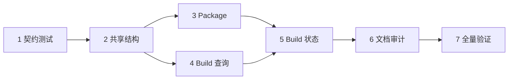

# 实施计划

## 步骤

| 步骤 | 修改位置 | 行为变化 | 验证与证据 | 退回方法 |
| --- | --- | --- | --- | --- |
| 1. 先锁定查询契约 | `tests/cli_taxonomy.rs`、`tests/execution_contract.rs`、`tests/package_lifecycle.rs`，新增 `tests/query_semantics.rs` | 测试要求 Build 与 Package 的 check、plan、status 使用各自固定字段；check 和 plan 不覆盖 latest；status 不接受 planned 或 ready | `cargo test --test query_semantics --test execution_contract --test package_lifecycle`，新测试先失败 | 删除新增测试，恢复三个已有测试文件 |
| 2. 建立共享查询结构 | `src/execution.rs` | 新增统一的 readiness report、plan report 和 execution status 核心结构；check 不带 execution ID，plan 使用 planDigest，status 只接受真实执行状态 | `cargo test --test execution_contract` 通过；序列化字段与设计一致 | 恢复 `src/execution.rs`，保留失败测试定位差异 |
| 3. 拆开 Package 查询和执行记录 | `src/commands/package.rs`、`src/main.rs` | check 只返回 readiness 与检查项；plan 只返回步骤和输出；两者不调用 `save_result`。实际 project、plugin、engine 和 run 才保存 execution，latest 只指向真实执行 | `cargo test --test package_commands --test package_lifecycle --test query_semantics` 通过；连续 run、check、plan 后 status 仍读取 run ID | 恢复 Package 两个文件和对应测试，不删除既有 execution JSON |
| 4. 拆开 Build check 与 plan | `src/commands/build_policy.rs`、`src/build_policy.rs`、`src/main.rs` | check 输出 readiness、检查项和 nextCommand；plan 输出步骤、argv、输出位置和 planDigest。两条命令不再共用 `BuildCheckOutput` | `cargo test --test query_semantics` 与 Build policy 单元测试通过；两条 JSON 结构不同 | 恢复 Build policy 文件，保留原有受控构建执行路径 |
| 5. 统一 Build 执行记录和 status | `src/commands/build.rs`、`src/commands/build_status.rs`、`src/commands/package.rs`、`src/execution.rs` | Task、Project、Engine Build 启动后写统一 execution 记录；`build status [execution-id]` 读取真实执行，旧 task-ref 查询保留迁移提示；Package status 使用同一核心字段 | `cargo test --test query_semantics --test execution_contract`；后台 Task 状态测试继续通过 | 保留旧任务元数据，回退新的 execution 存储读取路径 |
| 6. 审计非执行查询与文档 | `src/cli.rs`、`README.md`、`tests/cli_taxonomy.rs` | Workspace 保留 inspect、doctor、status；Task 保留 list、next；Skill 保留 list。统一所有同名帮助解释，补迁移说明 | `cargo test --test cli_taxonomy`；逐条运行 `udf build/package/workspace --help` | 恢复帮助和 README，不影响执行实现 |
| 7. 全量验证与真实 smoke | 全仓；workspace `neon-dev1` | 验证查询没有副作用，真实 Package/Build 的 latest 不被 check 和 plan 改写 | `cargo fmt --all -- --check`；严格 clippy；全量 cargo test；依次执行 package status、check、plan、status 并比较 ID；Build 同样比较 | 任一失败回到对应步骤，保留执行记录和日志供排查 |

## 依赖顺序

步骤 3 和步骤 4 在共享结构稳定后可以独立修改，但两者都会影响 `src/main.rs`，实际落地按顺序合并。其余步骤顺序执行。

## 风险

| 风险 | 控制方法 |
| --- | --- |
| 旧自动化依赖 Package check/plan 返回 execution ID | JSON 增加明确迁移诊断；README 标明 planDigest 替代计划 ID |
| 旧 `build status <task-ref>` 被脚本使用 | 保留 task-ref 解析，优先匹配 execution ID，human 输出迁移提示 |
| 后台 Build 无法可靠取得退出码 | 保留 unknown 状态和日志证据，不把进程退出猜成 succeeded |
| 旧 planned/ready Package 记录仍在磁盘 | 显式 ID 仍可读取，latest 查找只筛选真实执行状态 |
| 同时改 Build 与 Package 导致字段漂移 | 所有公共字段只在 `src/execution.rs` 定义，两个领域用同一组序列化测试 |
